# 大秦铁路接发车系统 - 车号设备信息


## 1. 通讯协议

### 1.1 工作流程

- 在本通讯协议下，车号识别系统的工作流程如图：  
  本协议对车号用户系统的CPU资源消耗较小。车号系统在收到车号标签信息后立即上传。  
    
  图2 车号系统工作流程（通讯协议)

### 1.2 打开功放

- 上位机发送

  ```
  @on&
  ```

- 上位机接收

  ```
  @on&
  ```

### 1.3 关闭功放

- 上位机发送

  ```
  @off&
  ```

- 上位机接收

  ```
  @off&
  ```

### 1.4 标签数据

- 下位机发送

  ```
  @********************AAAAAA&
  ```

  第一段数据：`********************`，20位为标签信息

  第二段数据：`AAAAAA`，6位为读取标签时刻，16进制ASCII码，“000000”~“FFFFFF”，单位ms。

- 例：

  ```
  @TC64K  494725512M042004C2A&
  @TC64K  494725512M042004C44&
  @TC64K  494725512M042004C51&
  @TC64K  494725512M042004C77&
  @TC64K  494725512M042004CC4&
  @TC64K  494725512M042004CD1&
  @TC64K  494725512M042004CF1&
  ```

  

## 2. 标签编码

### 2.1 机车FSK编码格式

机车电子标签中的`20`字节信息编码格式如表9-1所示。

其中固定信息包括：属性（1）+机车型号（3）+机车编号（4）+配属段（4）+端码（1），共13位，可变信息包括：本/补（1），客/货（1）+车次（5），共7位。

- 表11-1 机车FSK电子标签编码格式  
  

### 2.2 机车FS0编码格式

机车FS0电子标签中的`20`字节信息编码格式如表9-2所示。

其中固定信息包括：属性（1）+双节状态（1）+机车编号（4）+配属局，段（4）+车型（3），共13位，可变信息包括：本/补（1），客/货（1）+车次（5），共7位 。

- 表11-2 机车电子标签编码格式  
  

### 2.3 货车编码格式

车辆电子标签中的`20`字节的信息编码格式如表11-3所示。

- 表11-3 车辆电子标签编码格式  
  

### 2.4 客车编码格式

客车车辆电子标签中的`21`字节的信息编码格式如表11-4所示。

- 表11-4 客车车辆电子标签编码格式  
  


## 3. 车辆种类代号

- 客车

  |  #   | 车种   | 代号 |
  | :--: | ------ | ---- |
  |  1   | 软座车 | RZ   |
  |  2   | 硬座车 | YZ   |
  |  3   | 软卧车 | RW   |
  |  4   | 硬卧车 | YW   |
  |  5   | 行李车 | XL   |
  |  6   | 邮政车 | UZ   |
  |  7   | 餐车   | CA   |
  |  8   | 公务车 | GW   |
  |  9   | 卫生车 | WS   |

- 货车

  |  #   | 车种       | 代号 |
  | :--: | ---------- | ---- |
  |  1   | 敞车       | C    |
  |  2   | 棚车       | P    |
  |  3   | 平车       | N    |
  |  4   | 罐车       | G    |
  |  5   | 保温车     | B    |
  |  6   | 集装箱车   | X    |
  |  7   | 矿石车     | K    |
  |  8   | 长大货物车 | D    |
  |  9   | 毒品车     | W    |
