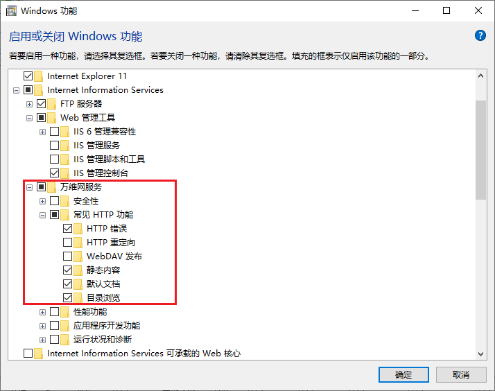
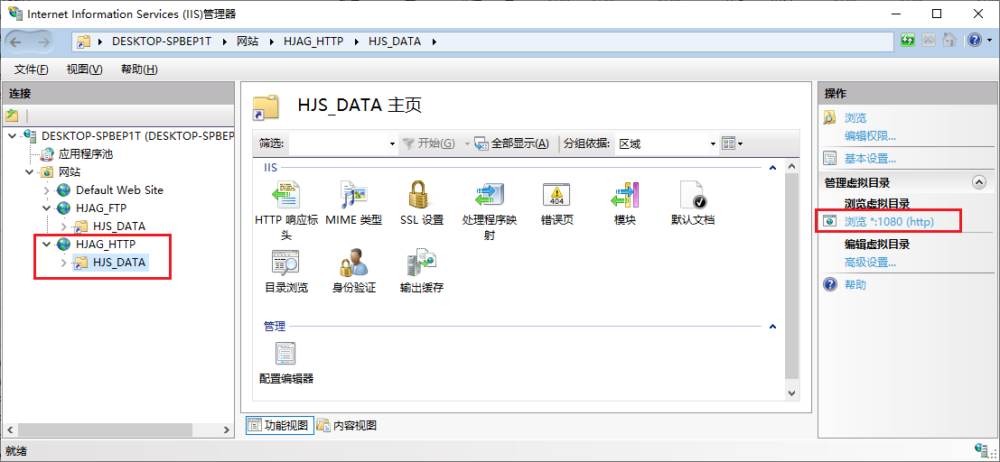
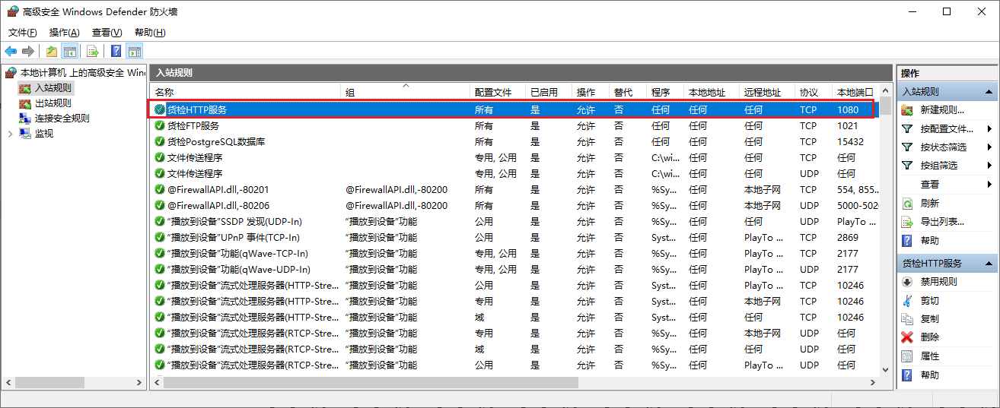

# 安装HTTP服务器

> 视频和音频播放的时候，需要使用HTTP协议，开启Windows自带的 HTTP 功能。

## 1. 开启 Windows 自带的 HTTP 功能

- `控制面板` → `程序` → `程序和功能` → `启用或关闭 Windows 功能`  
  

## 2. 设置 HTTP 网站

- 建设 HJAG_HTTP 的网站  
  根目录：`C:\inetpub\wwwroot`  
  开放端口：`1080`  
  虚拟目录：`HJS_DATA`，路径和 FTP服务 的路径保持一致。  
  

## 3. 开放相应端口

- `控制面板` → `系统和安全` → `Windows Defender 防火墙` → `高级设置` → `入站规则`  
  规则名称：`货检HTTP服务`  
  开放端口：`1080`，类型：`TCP`  
    

## 4. 确认设置正确

- 在 HJS_DATA 目录下面，放置任意的视频文件，录入 `XXX.mp4` ，在 浏览器的地址栏输入如下地址来确认是否可以正常播放  

  ```
  http://192.168.114.173:1080/hjs_data/XXX.mp4
  ```

  
