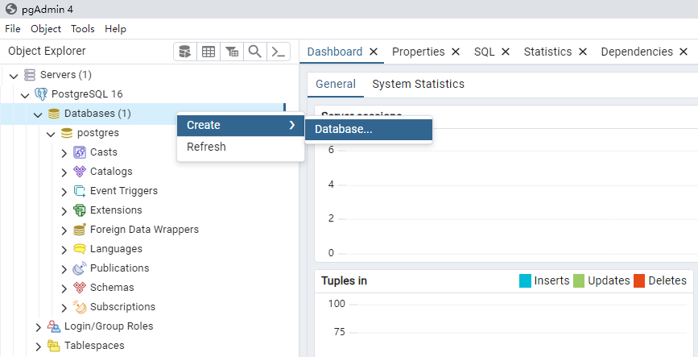
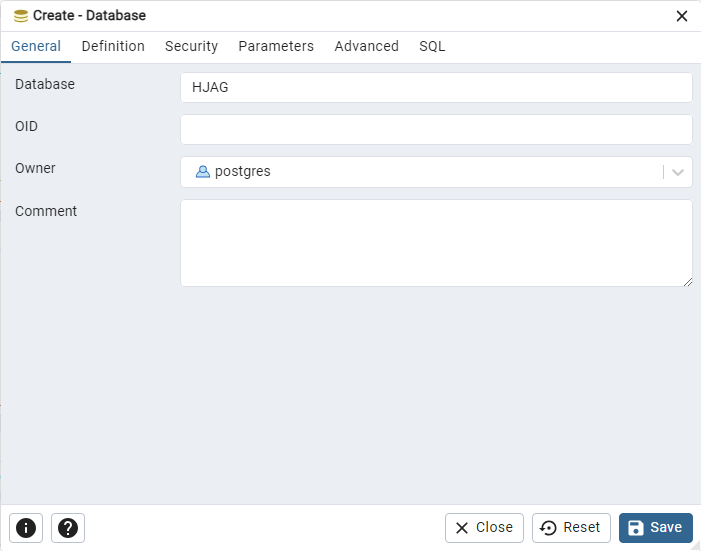

# 安装数据库服务

数据库采用免费、开源的 `PostgreSQL`，采用当前（2004年3月）最新的 `16.2-1` 的 X64 版本；但是客户端采用 32位 的 `9.6.24` 版本，是 32位 的最后一个版本。

## 1. 安装PostgreSQL

### 1.1 数据库安装

- 安装文件

  `postgresql-16.2-1-windows-x64.exe`

  按照默认进行安装，安装过程中，需要填写的参数按照如下进行设置：

- 安装参数

  | 项目       | 数值     | 默认值 | 备注             |
  | ---------- | -------- | ------ | ---------------- |
  | 管理者口令 | HJ123456 |        |                  |
  | 开放端口   | 15432    | 5432   | 尽量不采用默认值 |
  
- 附加安装不要安装任何内容

  `EDB Language V4.2-1` 如果需要安装，可以采用线下安装的方式。

### 1.2 安装语言附件

没有语言附件的话，用 `pgAdmin 4` 管理数据库的时候，尤其是错误信息码，可能是乱码。可以选择安装 `EDB Language V4.2-1` 附件，当然也可以选择不安装，因为服务器端的操作比较少。

- 语言附件

  `edb_languagepack_4.exe`

### 1.3 数据库语言

当前，PostgreSQL 在服务器端，仅仅支持 UTF-8，不能选择用 `GB18030` 或 `GBK` 内码，来创建数据库。  
代码开发的时候，必须处理好 UTF8 和 ANSI 字符之间的变换。

## 2. 创建数据库

用 `pgAdmin 4` 来创建货检专用数据表。

- 首次启动需要输入口令（安装时设置的管理者口令）：  
  

- 创建货检专用数据库  
  
  可以看到，PostgreSQL 在安装的时候，已经创建了默认的 Postgres 数据库，而我们需要创建 `HJAG` 的数据库。  
  
  在 `databases` 点击鼠标右键，选择 `create` → `database`
  
  
- 填写数据库名称  
    
  点击 `save` 按钮，确认创建数据库。画面左侧的 `databases` 下面就会出现 HJAG 的数据库名称。
  
- 尝试创建数据表

  `databases` → `HJAG` → `Schemas` → `Tables` ，点击鼠标右键，可以选择用图形界面方式建立数据表，比较麻烦，还是采用 SQL 方式更加方便。

  选择弹出菜单里面的最后一项 `Query Tool` 来创建数据表。

  ```SQL
  DROP TABLE IF EXISTS test1;
  DROP SEQUENCE IF EXISTS test1_id_seq;
  CREATE SEQUENCE test1_id_seq;
  CREATE TABLE IF NOT EXISTS test1 (
      id INTEGER DEFAULT nextval('test1_id_seq') PRIMARY KEY,
      name varchar(10) NOT NULL,
      created TIMESTAMP,
      modified TIMESTAMP
  );
  ```

  这是单一主键的数据表，货检系统中，一般是多个主键的数据表

  ```SQL
  DROP TABLE IF EXISTS test1;
  DROP SEQUENCE IF EXISTS test1_id_seq;
  CREATE SEQUENCE test1_id_seq;
  CREATE TABLE IF NOT EXISTS test1 (
      id1 INTEGER NOT NULL,
      id2 INTEGER NOT NULL,
      name varchar(10) NOT NULL,
      created TIMESTAMP,
      modified TIMESTAMP,
      PRIMARY KEY ( id1, id2 )
  );
  ```

  创建数据表之后，点击画面左侧的 `Tables` ，鼠标右键选择 `Refresh` 刷新，选择具体的数据表，鼠标右键选择 `Propertity` 查看该数据表的属性。

## 3. 创建基础表

创建大秦铁路的接发车系统相关的数据表。

### 3.4 MA_STA_MST

本次系统部署的所用车站信息表。7 个车站、车务段一共 8 条记录。

- 车站信息表

  ```sql
  DROP TABLE IF EXISTS MA_STA_MST;
  CREATE TABLE IF NOT EXISTS MA_STA_MST (
  	STA_COD CHAR(3) NOT NULL,
  	STA_IDX SMALLINT NOT NULL,
  	STA_NAM varchar(20) NOT NULL,
  	ftp_host varchar(20) NOT NULL,
  	ftp_data varchar(20) NOT NULL,
  	ftp_user varchar(20) NOT NULL,
  	ftp_password varchar(20) NOT NULL,
  	ftp_port INTEGER NOT NULL,
  	dbs_host varchar(20) NOT NULL,
  	dbs_name varchar(20) NOT NULL,
  	dbs_user varchar(20) NOT NULL,
  	dbs_password varchar(20) NOT NULL,
  	dbs_port INTEGER NOT NULL,
  	PRIMARY KEY ( STA_COD )
  );
  
  ```

- 字段说明：
  
  |  #   | 字段名称     | 说明               | 主键 | 字段类型                      | 备注                                  |
  | :--: | ------------ | ------------------ | ---- | ----------------------------- | ------------------------------------- |
  |  1   | STA_COD      | 车站编号           | ✅    | 固定长度字符串：3字节大写字母 | 例：DSZ 大石庄                        |
  |  2   | STA_IDX      | 车站序号           |      | 数字                          | 下行通过的逐个车站的序号（车务段：0） |
  |  3   | STA_NAM      | 车站名称           |      | 可变字符串：20字节            |                                       |
  |  4   | ftp_host     | FTP服务器IP地址    |      | 可变字符串：20字节            |                                       |
  |  5   | ftp_data     | FTP数据目录        |      | 可变字符串：20字节            | 默认：`hjs_data`                      |
  |  6   | ftp_user     | FTP登录用户名      |      | 可变字符串：20字节            |                                       |
  |  7   | ftp_password | FTP登录口令        |      | 可变字符串：20字节            |                                       |
  |  8   | ftp_port     | FTP开放端口        |      | 数字                          | 货检默认：`1021`                      |
  |  9   | dbs_host     | 数据库服务器IP地址 |      | 可变字符串：20字节            |                                       |
  |  10  | dbs_name     | 数据库名称         |      | 可变字符串：20字节            | 默认：`HJAG`                          |
  |  11  | dbs_user     | 数据库登录用户名   |      | 可变字符串：20字节            |                                       |
  |  12  | dbs_password | 数据库登录口令     |      | 可变字符串：20字节            |                                       |
  |  13  | dbs_port     | 数据库开放端口     |      | 数字                          | 货检默认：`15432`                     |
  
- 更新SQL

  ```SQL
  DELETE FROM MA_STA_MST;
  INSERT INTO MA_STA_MST VALUES('CWU', 0,'车务段', '192.168.114.173', 'hjs_data', 'FTP_USER', 'hj123456', 1021, '192.168.114.173', 'HJAG', 'postgres', 'HJ123456', 15432);
  INSERT INTO MA_STA_MST VALUES('AAA', 1,'车站#1', '192.168.114.173', 'hjs_data', 'FTP_USER', 'hj123456', 1021, '192.168.114.173', 'HJAG', 'postgres', 'HJ123456', 15432);
  INSERT INTO MA_STA_MST VALUES('BBB', 2,'车站#2', '192.168.114.173', 'hjs_data', 'FTP_USER', 'hj123456', 1021, '192.168.114.173', 'HJAG', 'postgres', 'HJ123456', 15432);
  INSERT INTO MA_STA_MST VALUES('CCC', 3,'车站#3', '192.168.114.173', 'hjs_data', 'FTP_USER', 'hj123456', 1021, '192.168.114.173', 'HJAG', 'postgres', 'HJ123456', 15432);
  INSERT INTO MA_STA_MST VALUES('DSZ', 4,'大石庄', '192.168.114.173', 'hjs_data', 'FTP_USER', 'hj123456', 1021, '192.168.114.173', 'HJAG', 'postgres', 'HJ123456', 15432);
  INSERT INTO MA_STA_MST VALUES('EEE', 5,'车站#5', '192.168.114.173', 'hjs_data', 'FTP_USER', 'hj123456', 1021, '192.168.114.173', 'HJAG', 'postgres', 'HJ123456', 15432);
  INSERT INTO MA_STA_MST VALUES('FFF', 6,'车站#6', '192.168.114.173', 'hjs_data', 'FTP_USER', 'hj123456', 1021, '192.168.114.173', 'HJAG', 'postgres', 'HJ123456', 15432);
  INSERT INTO MA_STA_MST VALUES('GGG', 7,'车站#7', '192.168.114.173', 'hjs_data', 'FTP_USER', 'hj123456', 1021, '192.168.114.173', 'HJAG', 'postgres', 'HJ123456', 15432);
  
  ```
  
  ※ 大秦铁路一共有 7 个车站安装了 `接发车系统`，所以应该插入 7 条数据。查询时用如下SQL：
  
  ```SQL
  SELECT * FROM MA_STA_MST ORDER BY STA_IDX;
  ```

### 3.3 MB_STK_MST

股道信息表，每个车站有上行、下行等 2 个股道，所以一共应该是 14 条记录。

- 车站信息表（前后站）

  ```sql
  DROP TABLE IF EXISTS MB_STK_MST;
  CREATE TABLE IF NOT EXISTS MB_STK_MST (
  	STK_COD CHAR(10) NOT NULL,
      STK_IDX SMALLINT NOT NULL,
  	STK_NAM varchar(20) NOT NULL,
  	PSH_FLG SMALLINT DEFAULT 0,
  	PSH_STA CHAR(3) DEFAULT '',
  	UPD_MAN varchar(16) DEFAULT '',
  	UPD_YMD CHAR(23) DEFAULT '',
  	PRIMARY KEY ( STK_COD )
  );
  
  ```

- 字段说明：
  
  |  #   | 字段名称 | 说明                   | 主键 | 字段类型                       | 备注                                     |
  | :--: | -------- | ---------------------- | ---- | ------------------------------ | ---------------------------------------- |
  |  1   | STK_COD  | 股道编号               | ✅    | 固定长度字符串：10字节大写字母 | 前3字节为车站编码（参照`更新SQL`的写法） |
  |  2   | STK_IDX  | 股道序号               |      | 短数字                         |                                          |
  |  3   | STK_NAM  | 股道名称               |      | 可变字符串：20字节             |                                          |
  |  4   | PSH_FLG  | 推送标志               |      | 短数字                         | 0：本站处理 1：推送其它车站              |
  |  5   | PSH_STA  | 推送车站编码           |      | 固定长度字符串：3字节大写字母  | 参照：`MC_STA_MST` 的 `STA_COD`          |
  |  6   | UPD_MAN  | 最终修改记录者（设备） |      | 可变长度字符串：最大16字节     |                                          |
  |  7   | UPD_YMD  | 最终修改时刻           |      | 固定长度字符串：23字节         |                                          |
  
- 更新SQL

  ```SQL
  DELETE FROM MB_STK_MST;
  INSERT INTO MB_STK_MST(STK_COD, STK_IDX, STK_NAM) VALUES('AAA_CZ_XXX',  1, '车站#1-下行');
  INSERT INTO MB_STK_MST(STK_COD, STK_IDX, STK_NAM) VALUES('AAA_CZ_SXX',  2, '车站#1-上行');
  INSERT INTO MB_STK_MST(STK_COD, STK_IDX, STK_NAM) VALUES('BBB_CZ_XXX',  3, '车站#2-下行');
  INSERT INTO MB_STK_MST(STK_COD, STK_IDX, STK_NAM) VALUES('BBB_CZ_SXX',  4, '车站#2-上行');
  INSERT INTO MB_STK_MST(STK_COD, STK_IDX, STK_NAM) VALUES('CCC_CZ_XXX',  5, '车站#3-下行');
  INSERT INTO MB_STK_MST(STK_COD, STK_IDX, STK_NAM) VALUES('CCC_CZ_SXX',  6, '车站#3-上行');
  INSERT INTO MB_STK_MST(STK_COD, STK_IDX, STK_NAM) VALUES('DSZ_CZ_XXX',  7, '大石庄-下行');
  INSERT INTO MB_STK_MST(STK_COD, STK_IDX, STK_NAM) VALUES('DSZ_CZ_SXX',  8, '大石庄-上行');
  INSERT INTO MB_STK_MST(STK_COD, STK_IDX, STK_NAM) VALUES('EEE_CZ_XXX',  9, '车站#5-下行');
  INSERT INTO MB_STK_MST(STK_COD, STK_IDX, STK_NAM) VALUES('EEE_CZ_SXX', 10, '车站#5-上行');
  INSERT INTO MB_STK_MST(STK_COD, STK_IDX, STK_NAM) VALUES('FFF_CZ_XXX', 11, '车站#6-下行');
  INSERT INTO MB_STK_MST(STK_COD, STK_IDX, STK_NAM) VALUES('FFF_CZ_SXX', 12, '车站#6-上行');
  INSERT INTO MB_STK_MST(STK_COD, STK_IDX, STK_NAM) VALUES('GGG_CZ_XXX', 13, '车站#7-下行');
  INSERT INTO MB_STK_MST(STK_COD, STK_IDX, STK_NAM) VALUES('GGG_CZ_SXX', 14, '车站#7-上行');
  
  ```
  
  ※ 该数据表只有 14 条记录。查询数据的时候，用如下SQL排序查询：
  
  ```SQL
  SELECT * FROM MB_STK_MST ORDER BY STK_IDX;
  ```

### 3.2 MC_ODD_MST

- 异常名称数据表

  ```sql
  DROP TABLE IF EXISTS MC_ODD_MST;
  CREATE TABLE IF NOT EXISTS MC_ODD_MST (
  	ODD_COD SMALLINT NOT NULL,
  	ODD_LVL SMALLINT NOT NULL,
  	ODD_NAM varchar(50) NOT NULL,
  	PRIMARY KEY ( ODD_COD )
  );
  
  ```
  
- 字段说明：
  
  |  #   | 字段名称 | 说明     | 主键 | 字段类型           | 备注 |
  | :--: | -------- | -------- | ---- | ------------------ | ---- |
  |  1   | ODD_COD  | 异常号码 | ✅    | 数字               |      |
  |  2   | ODD_LVL  | 报警等级 |      | 数字               |      |
  |  3   | ODD_NAM  | 异常名称 |      | 可变字符串：50字节 |      |
  
- 更新用SQL：
  
  ```sql
  DELETE FROM MC_ODD_MST;
  INSERT INTO MC_ODD_MST VALUES(1, 2, '车门开启');
  INSERT INTO MC_ODD_MST VALUES(2, 2, '车窗开启');
  INSERT INTO MC_ODD_MST VALUES(3, 2, '悬挂异物');
  INSERT INTO MC_ODD_MST VALUES(4, 2, '货物撒漏');
  INSERT INTO MC_ODD_MST VALUES(5, 2, '声音异常');
  INSERT INTO MC_ODD_MST VALUES(6, 2, '篷布飘起');
  INSERT INTO MC_ODD_MST VALUES(7, 2, '尾部软管未吊起');
  INSERT INTO MC_ODD_MST VALUES(8, 2, '搭扣异常');
  INSERT INTO MC_ODD_MST VALUES(9, 2, '闲杂人员扒乘');
  
  ```
  
  ※ 需要根据实际情况，修改该数据。
  
- 查询用SQL

  ```sql
  SELECT * FROM MC_ODD_MST;
  ```

## 4. 创建信息表

### 4.1 TA_USR_TBL

取消 `口令登录` 方式，使用电脑的设备代码作为作业作业过程中的标记，因为有值班表和监控系统，能够很容易找到真实的操作者。  
取消之后，可以简化一部分操作。相应的数据表也不需要创建。

### 4.2 TB_DEV_TBL

所有货检系统内的电脑的管理表，根本该表，可以查找到数据最终修改的设备，定位信息修改者。  
初期版本，暂不考虑该表的创建。将来考虑把 EXCEL 格式的设备表格，用 CSV 的格式，直接导入数据表的方式。

### 4.3 TC_TRN_TBL

- 列车信息数据表

  ```sql
  DROP TABLE IF EXISTS TC_TRN_TBL;
  CREATE TABLE IF NOT EXISTS TC_TRN_TBL (
  	TRN_YMD CHAR(15) NOT NULL,
  	DEV_COD CHAR(10) NOT NULL,
  	TRN_COD varchar(5) NOT NULL,
  	PAS_TMS INTEGER,
  	CAR_SPD varchar(20),
  	CAR_SP2 SMALLINT,
  	CAR_LEN SMALLINT NOT NULL,
  	CAR_ALL SMALLINT NOT NULL,
  	CAR_CNT SMALLINT NOT NULL,
  	ENG_CNT SMALLINT NOT NULL,
  	IOB_CAR_ALL SMALLINT NOT NULL,
  	IOB_ENG_CNT SMALLINT NOT NULL,
  	IOB_CAR_CNT SMALLINT NOT NULL,
  	STR_CAR_ALL SMALLINT NOT NULL,
  	STR_ENG_CNT SMALLINT NOT NULL,
  	STR_CAR_CNT SMALLINT NOT NULL,
  	NVR_CNT SMALLINT NOT NULL,
  	MP3_CNT SMALLINT NOT NULL,
  	HOT_CNT SMALLINT NOT NULL,
  	CAR_INI varchar(50),
  	STA_FLG SMALLINT DEFAULT 0,
  	TWO_FLG SMALLINT DEFAULT 0,
  	TRN_MEM varchar(50),
  	NEW_MAN varchar(16) NOT NULL,
  	NEW_YMD CHAR(23) NOT NULL,
  	UPD_MAN varchar(16) NOT NULL,
  	UPD_YMD CHAR(23) NOT NULL,
  	DEL_FLG SMALLINT DEFAULT 0,
  	PRIMARY KEY ( TRN_YMD, DEV_COD )
  );
  
  ```
  
- 字段说明：
  
  |  #   | 字段名称    | 说明                                | 主键 | 字段类型                   | 备注                                               |
  | :--: | ----------- | ----------------------------------- | ---- | -------------------------- | -------------------------------------------------- |
  |  1   | TRN_YMD     | 列车通过开始时刻（YYYYMMDD-HHmmSS） | ✅    | 固定长度字符串：15字节     |                                                    |
  |  2   | DEV_COD     | 设备编码（线路编号）                | ✅    | 固定长度字符串：10字节     | 例：DSZ_CZ_SXX 大石庄-上行线<br />参照：MA_DEV_MST |
  |  3   | TRN_COD     | 车次号码                            |      | 可变长度字符串：5字节      |                                                    |
  |  4   | PAS_TMS     | 通过时长                            |      | 整数                       | 单位：毫秒                                         |
  |  5   | CAR_SPD     | 通过速度                            |      | 可变长度字符串：20字节     | 速度描述                                           |
  |  6   | CAR_SP2     | 通过速度                            |      | 整数                       |                                                    |
  |  7   | CAR_LEN     | 车辆换长合计                        |      | 整数                       | 换长合计的10倍                                     |
  |  8   | CAR_ALL     | 车辆数量（货车 + 机车）             |      | 整数                       |                                                    |
  |  9   | CAR_CNT     | 货车数量                            |      | 整数                       |                                                    |
  |  10  | ENG_CNT     | 机车数量                            |      | 整数                       |                                                    |
  |  11  | IOB_CAR_ALL | 车位车辆数量（货车 + 机车）         |      | 整数                       |                                                    |
  |  12  | IOB_ENG_CNT | 车位机车数量                        |      | 整数                       |                                                    |
  |  13  | IOB_CAR_CNT | 车位货车数量                        |      | 整数                       |                                                    |
  |  14  | STR_CAR_ALL | 车号车辆数量（货车 + 机车）         |      | 整数                       |                                                    |
  |  15  | STR_ENG_CNT | 车号机车数量                        |      | 整数                       |                                                    |
  |  16  | STR_CAR_CNT | 车号货车数量                        |      | 整数                       |                                                    |
  |  17  | NVR_CNT     | 面阵图像数量                        |      | 整数                       |                                                    |
  |  18  | MP3_CNT     | 音频文件数量                        |      | 整数                       |                                                    |
  |  19  | HOT_CNT     | 轴温数据文件数量                    |      | 整数                       |                                                    |
  |  20  | CAR_INI     | 配置文件名称                        |      | 可变长度字符串：最大50字节 |                                                    |
  |  21  | STA_FLG     | 本站、下站处理标志                  |      | 短整数                     | 0：本站处理(*) 1：下站处理                         |
  |  22  | TWO_FLG     | 同时过车标志                        |      | 短整数                     | 0：正常过车 1：同时过车                            |
  |  23  | TRN_MEM     | 备注                                |      | 可变长度字符串：最大50字节 |                                                    |
  |  24  | NEW_MAN     | 创建记录者（设备）                  |      | 可变长度字符串：最大16字节 |                                                    |
  |  25  | NEW_YMD     | 创建时刻                            |      | 固定长度字符串：23字节     |                                                    |
  |  26  | UPD_MAN     | 修改记录者（设备）                  |      | 可变长度字符串：最大16字节 |                                                    |
  |  27  | UPD_YMD     | 修改时刻                            |      | 固定长度字符串：23字节     |                                                    |
  |  28  | DEL_FLG     | 删除标志                            |      | 短整数                     | 0：未删除(*) 1：删除                               |
  
- 查询用SQL

  ```SQL
  SELECT * FROM TC_TRN_TBL ORDER BY TRN_YMD DESC, DEV_COD;
  ```

### 4.4 TD_CAR_TBL

- 车辆数据信息表

  ```sql
  DROP TABLE IF EXISTS TD_CAR_TBL;
  CREATE TABLE IF NOT EXISTS TD_CAR_TBL (
  	TRN_YMD CHAR(15) NOT NULL,
  	DEV_COD CHAR(10) NOT NULL,
  	CAR_IDX SMALLINT NOT NULL,
  	RFD_COD varchar(25),
  	CAR_COD varchar(7),
  	ENG_FLG SMALLINT DEFAULT 0,
  	CHK_MAN SMALLINT DEFAULT 0,
  	CHK_AIR SMALLINT DEFAULT 0,
  	UPD_MAN varchar(16) NOT NULL,
  	UPD_YMD CHAR(23) NOT NULL,
  	DEL_FLG SMALLINT DEFAULT 0,
  	PRIMARY KEY ( TRN_YMD, DEV_COD, CAR_IDX )
  );
  
  ```
  
- 字段说明：
  
  |  #   | 字段名称 | 说明                                | 主键 | 字段类型                   | 备注                        |
  | :--: | -------- | ----------------------------------- | ---- | -------------------------- | --------------------------- |
  |  1   | TRN_YMD  | 列车通过开始时刻（YYYYMMDD-HHmmSS） | ✅    | 固定长度字符串：15字节     |                             |
  |  2   | DEV_COD  | 设备编码                            | ✅    | 固定长度字符串：10字节     | 参照：MA_DEV_MST            |
  |  3   | CAR_IDX  | 车辆编号                            |      | 整数                       |                             |
  |  4   | RFD_COD  | 电子标签                            |      | 可变长度字符串：25字节     | 正常是20字节                |
  |  5   | CAR_COD  | 车号                                |      | 可变长度字符串：7字节      | 机车4字节、货车7字节        |
  |  6   | ENG_FLG  | 机车标志                            |      | 数字                       | 0：货车 1：机车             |
  |  7   | CHK_MAN  | 人工已检标志                        |      | 整数                       | 0：未检 1：已检             |
  |  8   | CHK_AIR  | 智能已检标志（AI）                  |      | 整数                       | 0：未检 4：已检（相机数量） |
  |  9   | UPD_MAN  | 最终修改记录者（设备）              |      | 可变长度字符串：最大16字节 |                             |
  |  10  | UPD_YMD  | 最终修改时刻                        |      | 固定长度字符串：23字节     |                             |
  |  11  | DEL_FLG  | 处理状态                            |      | 数字                       | 0：未处理 1：处理结束       |
  
- 查询用SQL

  ```SQL
  SELECT * FROM TD_CAR_TBL ORDER BY TRN_YMD DESC, DEV_COD, CAR_IDX;
  ```

### 4.5 TE_ODD_TBL

- 异常信息数据表（本站数据）

  ```sql
  DROP TABLE IF EXISTS TE_ODD_TBL;
  CREATE TABLE IF NOT EXISTS TE_ODD_TBL (
  	TRN_YMD CHAR(15) NOT NULL,
  	DEV_COD CHAR(10) NOT NULL,
  	CAR_IDX SMALLINT NOT NULL,
  	LAC_IDX SMALLINT NOT NULL,
  	ODD_IDX SMALLINT NOT NULL,
  	ODD_COD SMALLINT NOT NULL,
  	ODD_NAM varchar(50) NOT NULL,
  	C_SCORE varchar(10) NOT NULL,
  	POS_X_0 SMALLINT NOT NULL,
  	POS_Y_0 SMALLINT NOT NULL,
  	POS_X_1 SMALLINT NOT NULL,
  	POS_Y_1 SMALLINT NOT NULL,
  	ROW_IDX SMALLINT DEFAULT 0,
  	COL_IDX SMALLINT DEFAULT 0,
  	MSK_WID SMALLINT DEFAULT 0,
  	MSK_HEI SMALLINT DEFAULT 0,
  	ODD_FLG SMALLINT DEFAULT 0,
  	RSV_FLG SMALLINT DEFAULT 0,
  	NEW_MAN varchar(16) NOT NULL,
  	NEW_YMD CHAR(23) NOT NULL,
  	UPD_MAN varchar(16) NOT NULL,
  	UPD_YMD CHAR(23) NOT NULL,
  	DEL_FLG SMALLINT DEFAULT 0,
  	PRIMARY KEY ( TRN_YMD, DEV_COD, CAR_IDX, LAC_IDX, ODD_IDX )
  );
  ```
  
- 字段说明：
  
  |  #   | 字段名称 | 说明                                | 主键 | 字段类型                   | 备注                          |
  | :--: | -------- | ----------------------------------- | ---- | -------------------------- | ----------------------------- |
  |  1   | TRN_YMD  | 列车通过开始时刻（YYYYMMDD-HHmmSS） | ✅    | 固定长度字符串：15字节     |                               |
  |  2   | DEV_COD  | 设备编码                            | ✅    | 固定长度字符串：10字节     | 参照：MA_DEV_MST              |
  |  3   | CAR_IDX  | 车辆编号                            | ✅    | 短数字                     |                               |
  |  4   | LAC_IDX  | 线阵相机编号                        | ✅    | 短数字                     |                               |
  |  5   | ODD_IDX  | 异常序号                            | ✅    | 短数字                     |                               |
  |  6   | ODD_COD  | 异常编号                            |      | 短数字                     | 参照：MB_ODD_MST              |
  |  7   | ODD_NAM  | 异常名称                            |      | 可变长度字符串：最大50字节 |                               |
  |  8   | C_SCORE  | 相似度                              |      | 可变长度字符串：最大10字节 |                               |
  |  9   | POS_X_0  | 位置坐标-x0                         |      | 短数字                     |                               |
  |  10  | POS_Y_0  | 位置坐标-y0                         |      | 短数字                     |                               |
  |  11  | POS_X_1  | 位置坐标-x1                         |      | 短数字                     |                               |
  |  12  | POS_Y_1  | 位置坐标-y2                         |      | 短数字                     |                               |
  |  13  | ROW_IDX  | 行编号                              |      | 短数字                     | 暂无用途                      |
  |  14  | COL_IDX  | 列标号                              |      | 短数字                     | 暂无用途                      |
  |  15  | MSK_WID  | 隐蔽宽度                            |      | 短数字                     | 暂无用途                      |
  |  16  | MSK_HEI  | 隐蔽高度                            |      | 短数字                     | 暂无用途                      |
  |  17  | ODD_FLG  | 报告标志                            |      | 数字                       | 0：人工标定 1：AI智能识别     |
  |  18  | RSV_FLG  | 解决标志                            |      | 数字                       | 0：未处理 1：误报 2：处理结束 |
  |  19  | NEW_MAN  | 创建记录者（设备）                  |      | 可变长度字符串：最大16字节 |                               |
  |  20  | NEW_YMD  | 创建时刻                            |      | 固定长度字符串：23字节     |                               |
  |  21  | UPD_MAN  | 修改记录者（设备）                  |      | 可变长度字符串：最大16字节 |                               |
  |  22  | UPD_YMD  | 修改时刻                            |      | 固定长度字符串：23字节     |                               |
  |  23  | DEL_FLG  | 处理状态                            |      | 数字                       | 0：未处理 1：处理结束         |
  
- 查询用SQL

  ```sql
  SELECT * FROM TE_ODD_TBL ORDER BY TRN_YMD DESC, DEV_COD, CAR_IDX, LAC_IDX;
  ```
  
- 插入数据SQL

  修改如下的SQL，更新数据表作为测试用：

  ```sql
  DELETE FROM TE_ODD_TBL WHERE TRN_YMD='20240327-000248' AND DEV_COD='DSZ_CZ_SXX';
  INSERT INTO TE_ODD_TBL VALUES('20240327-000248','DSZ_CZ_SXX',11, 1, 1, 1, 1, 'DESKTOP-SPBEP1T', '2024-04-07 05:19:27.920', 'DESKTOP-SPBEP1T', '2024-04-07 05:19:27.920', 0);
  INSERT INTO TE_ODD_TBL VALUES('20240327-000248','DSZ_CZ_SXX',12, 1, 1, 1, 1, 'DESKTOP-SPBEP1T', '2024-04-07 05:19:27.920', 'DESKTOP-SPBEP1T', '2024-04-07 05:19:27.920', 0);
  INSERT INTO TE_ODD_TBL VALUES('20240327-000248','DSZ_CZ_SXX', 3, 1, 2, 1, 1, 'DESKTOP-SPBEP1T', '2024-04-07 05:19:27.920', 'DESKTOP-SPBEP1T', '2024-04-07 05:19:27.920', 0);
  INSERT INTO TE_ODD_TBL VALUES('20240327-000248','DSZ_CZ_SXX', 4, 1, 2, 1, 1, 'DESKTOP-SPBEP1T', '2024-04-07 05:19:27.920', 'DESKTOP-SPBEP1T', '2024-04-07 05:19:27.920', 0);
  INSERT INTO TE_ODD_TBL VALUES('20240327-000248','DSZ_CZ_SXX', 5, 1, 3, 1, 1, 'DESKTOP-SPBEP1T', '2024-04-07 05:19:27.920', 'DESKTOP-SPBEP1T', '2024-04-07 05:19:27.920', 0);
  INSERT INTO TE_ODD_TBL VALUES('20240327-000248','DSZ_CZ_SXX', 6, 1, 3, 1, 1, 'DESKTOP-SPBEP1T', '2024-04-07 05:19:27.920', 'DESKTOP-SPBEP1T', '2024-04-07 05:19:27.920', 0);
  INSERT INTO TE_ODD_TBL VALUES('20240327-000248','DSZ_CZ_SXX', 7, 1, 4, 1, 1, 'DESKTOP-SPBEP1T', '2024-04-07 05:19:27.920', 'DESKTOP-SPBEP1T', '2024-04-07 05:19:27.920', 0);
  INSERT INTO TE_ODD_TBL VALUES('20240327-000248','DSZ_CZ_SXX', 8, 1, 4, 1, 1, 'DESKTOP-SPBEP1T', '2024-04-07 05:19:27.920', 'DESKTOP-SPBEP1T', '2024-04-07 05:19:27.920', 0);
  INSERT INTO TE_ODD_TBL VALUES('20240327-000248','DSZ_CZ_SXX', 9, 1, 5, 1, 1, 'DESKTOP-SPBEP1T', '2024-04-07 05:19:27.920', 'DESKTOP-SPBEP1T', '2024-04-07 05:19:27.920', 0);
  INSERT INTO TE_ODD_TBL VALUES('20240327-000248','DSZ_CZ_SXX',21, 2, 5, 1, 1, 'DESKTOP-SPBEP1T', '2024-04-07 05:19:27.920', 'DESKTOP-SPBEP1T', '2024-04-07 05:19:27.920', 0);
  INSERT INTO TE_ODD_TBL VALUES('20240327-000248','DSZ_CZ_SXX',22, 2, 6, 1, 1, 'DESKTOP-SPBEP1T', '2024-04-07 05:19:27.920', 'DESKTOP-SPBEP1T', '2024-04-07 05:19:27.920', 0);
  INSERT INTO TE_ODD_TBL VALUES('20240327-000248','DSZ_CZ_SXX', 3, 2, 6, 1, 0, 'DESKTOP-SPBEP1T', '2024-04-07 05:19:27.920', 'DESKTOP-SPBEP1T', '2024-04-07 05:19:27.920', 0);
  INSERT INTO TE_ODD_TBL VALUES('20240327-000248','DSZ_CZ_SXX', 4, 2, 7, 1, 1, 'DESKTOP-SPBEP1T', '2024-04-07 05:19:27.920', 'DESKTOP-SPBEP1T', '2024-04-07 05:19:27.920', 0);
  INSERT INTO TE_ODD_TBL VALUES('20240327-000248','DSZ_CZ_SXX', 5, 2, 8, 1, 0, 'DESKTOP-SPBEP1T', '2024-04-07 05:19:27.920', 'DESKTOP-SPBEP1T', '2024-04-07 05:19:27.920', 0);
  INSERT INTO TE_ODD_TBL VALUES('20240327-000248','DSZ_CZ_SXX', 6, 3, 9, 1, 1, 'DESKTOP-SPBEP1T', '2024-04-07 05:19:27.920', 'DESKTOP-SPBEP1T', '2024-04-07 05:19:27.920', 0);
  
  ```

### 4.6 TF_ODD_TBL

- 异常信息数据表（它站推送数据）

  ```sql
  DROP TABLE IF EXISTS TF_ODD_TBL;
  CREATE TABLE IF NOT EXISTS TF_ODD_TBL (
  	TRN_YMD CHAR(15) NOT NULL,
  	DEV_COD CHAR(10) NOT NULL,
  	CAR_IDX SMALLINT NOT NULL,
  	LAC_IDX SMALLINT NOT NULL,
  	ODD_IDX SMALLINT NOT NULL,
  	ODD_COD SMALLINT NOT NULL,
  	RSV_FLG SMALLINT DEFAULT 0,
  	NEW_MAN varchar(16) NOT NULL,
  	NEW_YMD CHAR(23) NOT NULL,
  	UPD_MAN varchar(16) NOT NULL,
  	UPD_YMD CHAR(23) NOT NULL,
  	DEL_FLG SMALLINT DEFAULT 0,
  	PRIMARY KEY ( TRN_YMD, DEV_COD, CAR_IDX, LAC_IDX, ODD_IDX )
  );
  ```
  
- 字段说明：
  
  |  #   | 字段名称 | 说明                                | 主键 | 字段类型                   | 备注                          |
  | :--: | -------- | ----------------------------------- | ---- | -------------------------- | ----------------------------- |
  |  1   | TRN_YMD  | 列车通过开始时刻（YYYYMMDD-HHmmSS） | ✅    | 固定长度字符串：15字节     |                               |
  |  2   | DEV_COD  | 设备编码                            | ✅    | 固定长度字符串：10字节     | 参照：MA_DEV_MST              |
  |  3   | CAR_IDX  | 车辆编号                            | ✅    | 短数字                     |                               |
  |  4   | LAC_IDX  | 线阵相机编号                        | ✅    | 短数字                     |                               |
  |  5   | ODD_IDX  | 异常序号                            | ✅    | 短数字                     |                               |
  |  6   | RSV_FLG  | 解决标志                            |      | 数字                       | 0：未处理 1：误报 2：处理结束 |
  |  7   | NEW_MAN  | 创建记录者（设备）                  |      | 可变长度字符串：最大16字节 |                               |
  |  8   | NEW_YMD  | 创建时刻                            |      | 固定长度字符串：23字节     |                               |
  |  9   | UPD_MAN  | 修改记录者（设备）                  |      | 可变长度字符串：最大16字节 |                               |
  |  10  | UPD_YMD  | 修改时刻                            |      | 固定长度字符串：23字节     |                               |
  |  11  | DEL_FLG  | 处理状态                            |      | 数字                       | 0：未处理 1：处理结束         |
  
- 查询用SQL

  ```sql
  SELECT * FROM TF_ODD_TBL ORDER BY TRN_YMD DESC, DEV_COD, CAR_IDX, LAC_IDX;
  ```

## 4. 开放对外服务

- 默认只对本机开放，修改 `C:\Program Files\PostgreSQL\16\data\pg_hba.conf` ，修改之后需要重启数据库的相关服务。

  找到如下内容（`IPv4 local connections`）：

  ```
  # TYPE  DATABASE        USER            ADDRESS                 METHOD
  # IPv4 local connections:
  host    all             all             127.0.0.1/32            scram-sha-256
  
  ```

  上述内容后面追加如下行：

  ```bash
  ## 允许 IP 地址从 192.168.0.1 到 192.168.0.254 的主机（客户端）。
  host all all 192.168.0.0/24 scram-sha-256
  ```

  本人虚拟机的实际情况（需要根据实际网络情况，进行设置）：

  ```
  host all all 192.168.114.0/24 scram-sha-256
  ```

- 对外开放数据库端口

  打开防火墙，在 `入站规则` 增加 `PostgreSQL` 的端口号（默认`5432`，货检系统采用 `15432`）。

注意：如果有 2 个网卡的话，需要把 2 个IP的 掩码都添加，否则会造成有的访问正常，其它访问不正常的现象。

# 疑难解析

## 1. 数据更新正常，但客户端连接异常

- 问题描述  
  数据库更新正常；  
  客户端无法连接到数据库，导致客户端安装文件读写方式连接 FTP数据服务。
- 解决办法  
  参照 `4. 开放对外服务`，开放针对客户端IP的访问许可。
