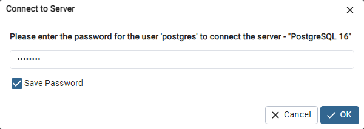

# 货检的数据库环境

数据库采用免费、开源的 `PostgreSQL`，采用当前（2004年3月）最新的 `16.2-1` 的 X64 版本；但是客户端采用 32位 的 `9.6.24` 版本，是 32位 的最后一个版本。

## 1. 安装PostgreSQL

按照默认进行安装，安装过程中，需要填写的参数按照如下进行设置：

- 安装参数

  | 项目       | 数值     | 默认值 | 备注 |
  | ---------- | -------- | ------ | ---- |
  | 管理者口令 | HJ123456 |        |      |
  | 开放端口   | 15432    | 5432   |      |
  |            |          |        |      |

- 附加安装不要安装任何内容

  `EDB Language V4.2-1` 如果需要安装，可以采用线下安装的方式。

  

## 2. 创建数据库

用 `pgAdmin 4` 来创建货检专用数据表。

- 首次启动需要输入口令（安装时设置的管理者口令）：  
  

- 创建货检专用数据库  
  
  可以看到，PostgreSQL 在安装的时候，已经创建了默认的 Postgres 数据库，而我们需要创建 `HJAG` 的数据库。  
  
  在 `databases` 点击鼠标右键，选择 `create` → `database`
  
  
- 填写数据库名称  
    
  点击 `save` 按钮，确认创建数据库。画面左侧的 `databases` 下面就会出现 HJAG 的数据库名称。
  
- 尝试创建数据表

  `databases` → `HJAG` → `Schemas` → `Tables` ，点击鼠标右键，可以选择用图形界面方式建立数据表，比较麻烦，还是采用 SQL 方式更加方便。

  选择弹出菜单里面的最后一项 `Query Tool` 来创建数据表。

  ```SQL
  DROP TABLE IF EXISTS test1;
  DROP SEQUENCE IF EXISTS test1_id_seq;
  CREATE SEQUENCE test1_id_seq;
  CREATE TABLE IF NOT EXISTS test1 (
      id INTEGER DEFAULT nextval('test1_id_seq') PRIMARY KEY,
      name varchar(10) NOT NULL,
      created TIMESTAMP,
      modified TIMESTAMP
  );
  ```

  这是单一主键的数据表，货检系统中，一般是多个主键的数据表

  ```SQL
  DROP TABLE IF EXISTS test1;
  DROP SEQUENCE IF EXISTS test1_id_seq;
  CREATE SEQUENCE test1_id_seq;
  CREATE TABLE IF NOT EXISTS test1 (
      id1 INTEGER NOT NULL,
      id2 INTEGER NOT NULL,
      name varchar(10) NOT NULL,
      created TIMESTAMP,
      modified TIMESTAMP,
      PRIMARY KEY ( id1, id2 )
  );
  ```

  创建数据表之后，点击画面左侧的 `Tables` ，鼠标右键选择 `Refresh` 刷新，选择具体的数据表，鼠标右键选择 `Propertity` 查看该数据表的属性。

## 3. 创建数据表

