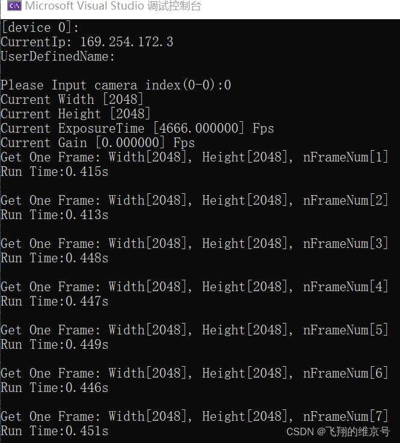

>  海康⼯业相机SDK+OpenCV实例(2)：https://blog.csdn.net/weixin_44229257/article/details/124407308?spm=1001.2014.3001.5502

# RawDataFormatConvert详解

> 在前⽂讲解了海康 ⼯业相机 SDK与OpenCV的安装与环境配置，本⽂接着讲解SDK给的OpenCV的demo，主要实现 RawDataFormatConvert 的功能，即将海康连续采集的图像转化为 OpenCV 的 Mat 格式并显⽰于屏幕。

## 1. 海康⼯业相机SDK详解

在海康SDK安装位置，找到 `D:\Softwares\MVS\Development\Samples\OpenCV\VC` 的 `Samples_OpenCV.sln` 并打开，下⾯会先对SDK的调⽤相机的各功能进⾏详解：

1. ⾸先定义句柄和相机操作的返回值，当相机操作出现问题时，需要将nRet，可以根据对应的返回值查询可能出现的问题。  

   ```C++
   int nRet = MV_OK;
   void* handle = NULL;
   ```

2. 列出当前的设备管理⽬录，输⼊对应值，选择相应的相机设备。  

   ```C++
   // Enum device
   MV_CC_DEVICE_INFO_LIST stDeviceList;
   memset(&stDeviceList, 0, sizeof(MV_CC_DEVICE_INFO_LIST));
   nRet = MV_CC_EnumDevices(MV_GIGE_DEVICE | MV_USB_DEVICE, &stDeviceList);
   if (MV_OK != nRet)
   {
       printf("Enum Devices fail! nRet [0x%x]\n", nRet);
       break;
   }
   if (stDeviceList.nDeviceNum > 0)
   {
       for (unsigned int i = 0; i < stDeviceList.nDeviceNum; i++)
       {
           printf("[device %d]:\n", i);
           MV_CC_DEVICE_INFO* pDeviceInfo = stDeviceList.pDeviceInfo[i];
           if (NULL == pDeviceInfo)
           {
               break;
           }
           PrintDeviceInfo(pDeviceInfo);
       }
   }
   else
   {
       printf("Find No Devices!\n");
       break;
   }
   
   // input the format to convert
   unsigned int nFormat = 0;
   // select device to connect
   printf("Please Input camera index(0-%d):", stDeviceList.nDeviceNum-1);
   unsigned int nIndex = 0;
   scanf("%d", &nIndex);
   if (nIndex >= stDeviceList.nDeviceNum)
   {
       printf("Input error!\n");
       break;
   }
   ```

3. 创建句柄并打开相机设备  

   ```C++
   // Select device and create handle
   nRet = MV_CC_CreateHandle(&handle, stDeviceList.pDeviceInfo[nIndex]);
   if (MV_OK != nRet)
   {
       printf("Create Handle fail! nRet [0x%x]\n", nRet);
       break;
   }
   // open device
   nRet = MV_CC_OpenDevice(handle);
   if (MV_OK != nRet)
   {
       printf("Open Device fail! nRet [0x%x]\n", nRet);
       break;
   }
   ```

4. 设置相机参数，图⽚的宽度与⾼度、相机的曝光时间与增益；返回相机参数，图⽚的宽度与⾼度、相机的曝光时间与增益。  

   ```C++
   nRet = SetParameters(handle, WidthValue, HeightValue, ExposureTimeValue, GainValue);
   if (MV_OK != nRet)
   {
       printf("Set parameters fail! nRet [0x%x]\n", nRet);
       break;
   }
   nRet = GetParameters(handle);
   if (MV_OK != nRet)
   {
       printf("Get parameters fail! nRet [0x%x]\n", nRet);
       break;
   }
   ```

5. 设置⽹络最佳的包⼤⼩，设置相机的触发模式  

   ```C++
   // Detection network optimal package size(It only works for the GigE camera)
   if (stDeviceList.pDeviceInfo[nIndex]->nTLayerType == MV_GIGE_DEVICE)
   {
       int nPacketSize = MV_CC_GetOptimalPacketSize(handle);
       if (nPacketSize > 0)
       {
           nRet = MV_CC_SetIntValue(handle,"GevSCPSPacketSize",nPacketSize);
           if(nRet != MV_OK)
           {
               printf("Warning: Set Packet Size fail nRet [0x%x]!", nRet);
           }
       }
       else
       {
           printf("Warning: Get Packet Size fail nRet [0x%x]!", nPacketSize);
       }
   }
   // Set trigger mode as off
   nRet = MV_CC_SetEnumValue(handle, "TriggerMode", 0);
   if (MV_OK != nRet)
   {
       printf("Set Trigger Mode fail! nRet [0x%x]\n", nRet);
       break;
   }
   // Get payload size
   MVCC_INTVALUE stParam;
   memset(&stParam, 0, sizeof(MVCC_INTVALUE));
   nRet = MV_CC_GetIntValue(handle, "PayloadSize", &stParam);
   if (MV_OK != nRet)
   {
       printf("Get PayloadSize fail! nRet [0x%x]\n", nRet);
       break;
   }
   g_nPayloadSize = stParam.nCurValue;
   ```

6. 开启连续采集模式，并分配缓冲内存区  

   ```C++
   // Start grab image
   nRet = MV_CC_StartGrabbing(handle);
   if (MV_OK != nRet)
   {
       printf("Start Grabbing fail! nRet [0x%x]\n", nRet);
       break;
   }
   MV_FRAME_OUT stImageInfo = {0};
   memset(&stImageInfo, 0, sizeof(MV_FRAME_OUT));
   unsigned char * pData = (unsigned char *)malloc(sizeof(unsigned char) * (g_nPayloadSize));
   if (pData == NULL)
   {
       printf("Allocate memory failed.\n");
       break;
   }
   ```

7. 停⽌采集  

   ```C++
   // Stop grab image
   nRet = MV_CC_StopGrabbing(handle);
   if (MV_OK != nRet)
   {
       printf("Stop Grabbing fail! nRet [0x%x]\n", nRet);
       break;
   }
   ```

8. 关闭相机并摧毁句柄  

   ```C++
   // Close device
   nRet = MV_CC_CloseDevice(handle);
   if (MV_OK != nRet)
   {
       printf("ClosDevice fail! nRet [0x%x]\n", nRet);
       break;
   }
   
   // Destroy handle
   nRet = MV_CC_DestroyHandle(handle);
   if (MV_OK != nRet)
   {
       printf("Destroy Handle fail! nRet [0x%x]\n", nRet);
       break;
   }
   ```

## 2. OpenCV相关操作

- 在 RawDataFormatConvert 中，最主要的功能是将连续采集的图⽚，从相机的缓冲区域转化 OpenCV 的 Mat 格式，并在屏幕上显⽰，因此我们可以利⽤ Mat 格式调⽤ OpenCV 的相关操作。  

  ```C++
  while (true)
  {
      clock_t startTime, endTime;
      startTime = clock();
      nRet = MV_CC_GetImageBuffer(handle, &stImageInfo, 1000);
      if (nRet == MV_OK)
      {
          printf("Get One Frame: Width[%d], Height[%d], nFrameNum[%d]\n",
          stImageInfo.stFrameInfo.nWidth, stImageInfo.stFrameInfo.nHeight, stImageInfo.stFrameInfo.nFrameNum);
      }
      else
      {
          printf("No data[0x%x]\n", nRet);
          free(pData);
          pData = NULL;
          break;
      }
      cv::Mat srcImage;
      srcImage = cv::Mat(stImageInfo.stFrameInfo.nHeight, stImageInfo.stFrameInfo.nWidth, CV_8UC1, stImageInfo.pBufAddr);
      cv::namedWindow("srcImage", 0);
      cv::resizeWindow("srcImage", 918, 768);
      cv::imshow("srcImage", srcImage);
      cv::waitKey(1);
      srcImage.release();
      nRet = MV_CC_FreeImageBuffer(handle, &stImageInfo);
      endTime = clock();
      std::cout << "Run Time:" << (double)(endTime - startTime) / CLOCKS_PER_SEC << "s" << std::endl;
      std::cout<< std::endl;
  }
  ```

  根据上述代码，我们将 ImageBuffer 区域的数据转化为 Mat 格式，并且根据 **CV_8UC1** 格式，可知图像应为灰度图，这要与相机图像格式对应。

## 3. 运⾏结果

- 运⾏结果如图所⽰：  
    
  