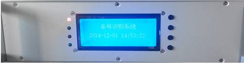
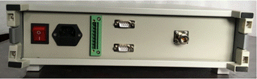

# 2. 功能简介

## 2.1. 前面板

- BT-310型车号识别系统的前面板如图2-1所示。  
    
  *图2-1 BT-310型车号识别系统主机前面板图*

  前面板左侧方有4个LED指示灯，右侧中部有一个液晶显示屏，用于显示车号主机的工作状态。

  4个LED指示灯的功能分别为“电源指示”、“功放开关”、“标签接收”和“磁钢接收”。系统电源开关打开后，系统上电，程序正常运行后，“电源”指示灯亮。车号主机接收到“开功放”指令时，将射频子系统功放打开时，“功放”指示灯亮；车号主机接收到“关功放”指令时，将射频子系统功放关闭时，“功放”指示灯灭。在功放打开的状态下，当车号标签位于天线的接收区域内时，车号主机实时解码并通过串口1上传接收到的车号标签数据。每接收并上传一帧数据时“发送”指示灯闪烁一次（通讯协议1）。在功放打开的状态下，当车号标签位于天线的接收区域内时，车号主机实时解码并存储接收到的车号标签数据，同时串口2会根据配置的协议进行数据的上传。当成功的接收到标签数据后，“标签接收”指示灯亮。。

  中间的液晶显示屏显示接收标签和磁钢信息，在配置时显示对应的配置信息和菜单信息。当接收到标签数据时，实时显示标签数据、标签序号和每个标签的读取次数。每收到一个新标签时液晶屏显示当前标签的信息，共24个字符，前20个字符是读取的标签内容，具体参考下文件“标签编码”部分。第21、22位为读取标签的序号，从功放打开后开始计数，每读取一个新标签后加1。第23、24位为每个标签的读取次数，同一标签每读取一次加1。

## 2.2. 后面板

- BT-310型车号识别系统的后面板如图2-1所示。  
    
  *图2-2 BT-310型车号识别系统主机后面板图*

  主机的后面板有电源开关、电源插座、串口1、串口2、天线接口和风扇。电源插座内含保险，并有一只备用保险。背板上两串口分别实现两种通讯协议。天线接口通过射频电缆联接天线。电源插座接入220VAC±10%。风扇内置于机箱内自动开启散热。当环境温度高于65℃时自动停机，避免主机过热损坏。

  功放可以通过串口指令打开和关闭，对于带有数字I/O控制的主机，功放也可以通过车轮传感器打开。功放打开后延时一段时间自动关闭。延时时间可以配置（详见“配套软件”部分和按键操作部分）。在功放打开状态下，如果再次收到“功放打开”的指令，或收到车轮传感器的车轮信号，延时时间重新计时。例如，在使用串口指令控制功放开关时，可以将延时时间设置为1800秒（30分钟），当列车车轮触发车轮传感器或者其他传感器时，触发信号打发出“打开功放”指令，在火车通过后发出“关闭功放”指令。如果在列车通过时出现停车等一些异常情况时，未正常发出“关闭功放”指令，这时车号主机可以在30分钟后自动关闭功放。再如使用车轮传感器控制功放开关时，可以将延时时间配置为20秒，这样在第一个车轮通过任意一只车轮传感器时车号主机自动打开功放；当任意车轮再通过任意一只传感器时重新计算延时时间；当整列车通过车号识别系统后20秒后功放自动关闭。

对于带有数字I/O的车号识别系统，可以接4路车轮传感器，并根据车号传感器的信号自动控制功放的开关。车轮传感器可以用磁钢，也可以用接近开关。如果您需要在每侧安装多于一只接近开关，直接并联即可。对于用接近开关的情况，传感器供电电压12V，最大输出电流1A。