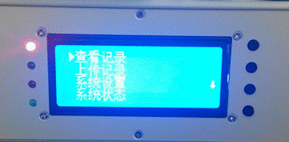
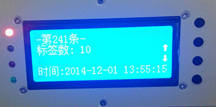
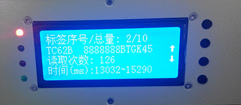
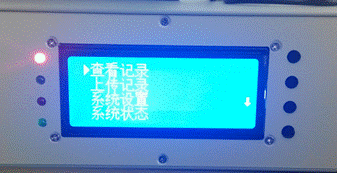
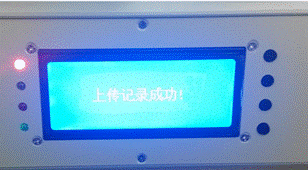
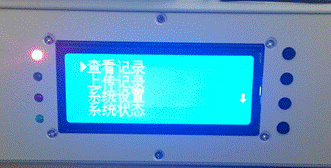
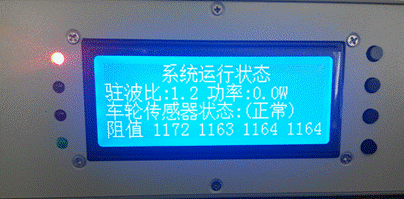
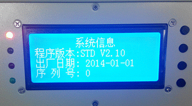

# 4. 按键菜单信息查询

## 4.1. 查看记录

- ① 按下右侧最下方“确定”按钮，查看菜单  
    
  图 3-34 查看菜单

- ② 选择“查看记录”，点击“确认”。  
    
  图 3-35 查看记录提示1

- ③ 按下“确认”键，查看记录数  
    
  图 3-36 查看记录提示2

- ④ 按下“上翻”、“下翻”键，查看记录。  
  
  图 3-37 查看记录

## 4.2. 上传记录

- ① 按下右侧最下方“确定”按钮，查看菜单  
    
  图 3-38 菜单查看

- ② 选择“上传记录”，点击“确认”，液晶提示“上传记录成功”。  
    
  图 3-39 上传成功提示

## 4.3. 系统状态

- ① 按下右侧最下方“确定”按钮，查看菜单  
    
  图 3-40 菜单查看

- ② 选择“系统状态”，点击“确认”，液晶显示运行状态信息。  
    
  图 3-41 系统状态

## 4.4. 系统信息

- ① 按下右侧最下方“确定”按钮，查看菜单  
    
  图 3-42 菜单查看

- ② 选择“系统信息”，点击“确认”，液晶显示系统信息。    
  
