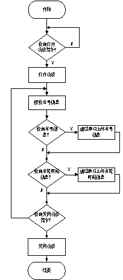
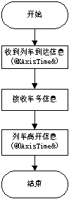
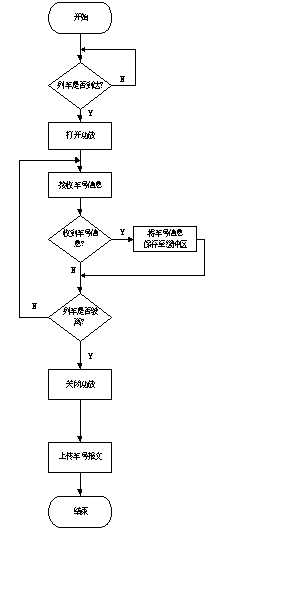
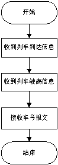

# 5. 通讯协议

BT-310型车号识别系统同时实现两种通讯协议。串口1实现通讯协议1、2、3。串口2实现根据用户定制的通信协议。系统上电时功放为关闭状态。可以通过串口指令打开或关闭功放。当功放打开后，30分钟内未收到关闭功放指令，功放可以自动关闭。如果在此期间内再次收到`打开功放`指令，重新开始计时。

串口1波特率出厂默认设置为19200。串口1波特率可以通过随机附送的软件方便的进行设置，车号主机可以记忆设置的参数，断电不丢失。串口2波特率固定为19200，不能设置。具体设置方法请参考`配套软件`部分。

## 5.1. 通讯协议1

- 在本通讯协议下，车号识别系统的工作流程如下：  
    
  图5-1车号系统工作流程（通讯协议1）

本协议流程简单，方便易用。本协议可以实现通过判断车轮传感器自动识别列车到达和离开读取设备，然后打开或关闭功放。当列车到达后，天线开始发射电磁波，读取车号标签信息和车轮通过时间信息。当识别到车号标签信息和车轮时间信息后，立即通过串口上传标签信息和车轮。当列车驶离后或者超过默认延迟时间后，设备自动关闭功放，回到初始状态，等待下一次`打开功放`指令。本协议不但中含有标签的全部信息，还含有标签序号信息，每个标签读取次数的信息和车轮时间新，方便用户使用。

- 在本通讯协议下，车号用户程序的工作流程如图5-2：  
  
  图5-2 用户程序流程（通讯协议1）

本模式通讯协议使用ASCII码，帧头为‘@’， 帧尾为‘&’。

1. 开功放和轴数据：

   上位机接收：`@XAAAAAA&`

   其中X代表车轮传感器的编号，X=1,2,3,4；后面六位字符表示车轮通过时刻，如果全部为0表示列车到达。车号识别系统自动打开功放。

   `AAAAAA`为轴的时刻信息，16进制ASCII码，`000000`~`999999`。

2. 关功放

   上位机接收：`@0******&`

   当收到的车轴信息中首字母为`0`，则表示列车驶离或者超过规定延迟时间，为收到标签和车轮信息，然后系统自动关闭功放。

3. 标签数据

   下位机发送：`@********************AAAAAA&`

   其中`********************`为20字节标签信息，格式详见`标签编码`部分。当车厢到达天线读取范围时，第一读取到标签时，标签信息为20位；第二次及以后再次读该标签时，则为空字符串。

   `AAAAAA`为读取标签的时刻信息，16进制ASCII码，`000000`~`999999`。

## 5.2. 通讯协议2

- 在本通讯协议下，车号识别系统的工作流程如图5-3：

  本协议对车号用户系统的CPU资源消耗较小。车号系统在收到车号标签信息后不会立即上传，而是保存在系统的缓冲中，等列车驶离或者超过规定延迟时间后，生成报文再上传给用户。

    
  图5-3 车号系统工作流程（通讯协议2）

- 在本通讯协议下，车号用户程序的工作流程如图5-4：

    
  图5-4 用户程序流程（通讯协议2）

1. 开功放

   上位机发送：`@on&`

   上位机接收：`@on&`

2. 关功放

   上位机发送：`@off&`

   上位机接收：`@off&`

3. 标签数据

   下位机发送：`@********************AAAAAA&`，其中

   第一段数据：`********************`，20位为标签信息，

   第二段数据：`AAAAAA`，6位为读取标签时刻，

## 5.3. 通讯协议3

是针对客户开发的协议，对使用数量较多的客户，可针对客户的软件定制开发合适的协议，具体需求请和厂商联系。

## 5.4. 获取状态信息的相关协议

- 获取状态信息的协议包括：

  |  №   | 功能             | 上位机发     | 下位机收                                                     | 备注 |
  | :--: | ---------------- | ------------ | ------------------------------------------------------------ | ---- |
  |  1   | 获取所有状态信息 | `@state&`    | `@state=[Baud1=19200][Delay=30][AMP=1.6][FRQ=916.0][Thresh=150][sn=201506018][ver=STD V2.11][SWR=1.3][PW=1.7][Sen=228,0,0,0]&` | ※1   |
  |  2   | 获取驻波比       | `@getSWR&`   | `@SWR=1.3&`                                                  |      |
  |  3   | 获取天线增益     | `@getAMP&`   | `@AMP=1.6&`                                                  |      |
  |  4   | 获取频率         | `@getFRQ&`   | `@FRQ=916.0&`                                                |      |
  |  5   | 获取传感器信息   | `@getSen&`   | `@Sen=226,0,0,0&`                                            |      |
  |  6   | 获取天线功放延时 | `@getDelay&` | `@Delay=30&`                                                 | ※2   |

  ※1

  |  №   | 参数   | 说明                                                         |
  | :--: | ------ | ------------------------------------------------------------ |
  |  1   | Baud1  | 串口波特率                                                   |
  |  2   | Delay  | 功放关闭延时                                                 |
  |  3   | AMP    | 天线增益                                                     |
  |  4   | FRQ    | 天线工作频率                                                 |
  |  5   | Thresh | 传感器灵敏度阈值                                             |
  |  6   | sn     | 设备出厂序列号                                               |
  |  7   | ver    | 硬件版本号                                                   |
  |  8   | SWR    | 天线驻波比                                                   |
  |  9   | PW     | 天线功率                                                     |
  |  10  | Sen    | 传感器阻值，顺序自上至下，0或999：阻值异常，可能传感器损坏或未安装传感器，其他值：设备正常。 |

  ※2 阻值对应磁钢自上至下。

获取状态信息的协议包括：

1. 获取所有状态信息

   `@state&`

   `@state=[Baud1=19200][Delay=30][AMP=1.6][FRQ=916.0][Thresh=150][sn=201506018][ver=STD V2.11][SWR=1.3][PW=1.7][Sen=228,0,0,0]&`

   Baud1：串口波特率。

   Delay：功放关闭延时

   AMP：天线增益。

   FRQ：天线工作频率。

   Thresh：传感器灵敏度阈值。

   sn：设备出厂序列号。

   ver：硬件版本号。

   SWR：天线驻波比。

   PW：天线功率。

   Sen：传感器阻值，顺序自上至下，0或999：阻值异常，可能传感器损坏或未安装传感器，其他值：设备正常。

2. 获取驻波比

   上位机发：`@getSWR&`

   下位机收：`@SWR=1.3&`

3. 获取天线增益

   上位机发：`@getAMP&`

   下位机收：`@AMP=1.6&`

4. 获取频率

   上位机发：`@getFRQ&`

   下位机收：`@FRQ=916.0&`

5. 获取传感器信息

   上位机发：`@getSen&`

   下位机收：`@Sen=226,0,0,0&`，阻值对应磁钢自上至下。

6. 获取天线功放延时

   上位机发：`@getDelay&`

   下位机收：`@Delay=30&`

## 5.5. 数字I/O控制功放开关

车号识别系统带有车轮传感器，可以配置为4个，3个和2个。车轮传感器可以识别列车的车轮到达，并产生I/O信号量，系统可以根据数字I/O的信号自动开关功放和记录车轮通过的时刻。当通道中有车轮信号输入时，车号识别系统产生车轮传感器通过信息帧，其格式为：`@X******&`，其中：

`X` 为 0,1.2,3,4 其中的一种，它表示下面两种协议：

1. 如X=0，表示列车驶离或者超过规定延迟时间，
2. 如X=1.2,3,4，表示车轮通过车轮传感器的编号。

`******` 为6位字符，表示车轮通过传感器的时刻，如果6位字符全部为零，表示列车到达。