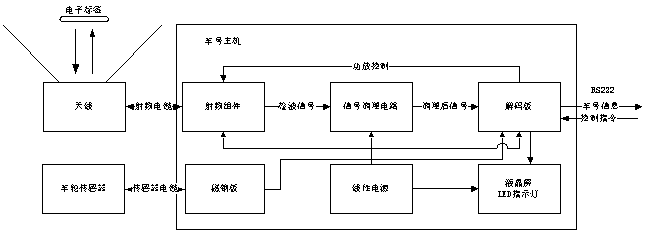

# 6. 工作原理

- 图6-1为铁路车号识别系统原理框图：  
  
  图6-1 铁路车号识别系统原理框图

  铁路车号识别系统的组成原理如图6-1所示，其中天线水平安装于铁轨中间，天线通过射频电缆与车号主机相连。车轮传感器安装在专用夹具上，然后夹具通过螺栓安装于铁轨底部。车号主机通常安装于室内。

  板状天线是一个定向极化天线，读取范围 120 度，驻波比<1.4，在本系统中实现电磁波的射和标签信号接收的功能。

  射频源产生射频信号，经功率放大电路向外发射射频信号。功率放大电路可通过控制端控制功率放大电路的开关。接收到的标签信号经检波电路传至信号调理电路。为防止输出接口开路烧毁检波电路，射频组件设计了保护电路。

  信号调理电路实现检波信号调理功能，将信号幅值调整到与解码板相兼容的范围内。解码板是本系统的核心，完成车号解码的功能，完成功放控制功能，完成与上位机通讯的功能，接收功放控制指令、传输解码后的标签信息功能。

  磁钢板通过接收车轮到达的信息，然后将电信号放大滤波，转变为12v的数字I/O量传递到解码板中。

本系统的工作过程为如下：

- 解码板等待车轮传感器发送列车到达信息，然后打开功放指令。接收到打开功放指令后，打开射频组件的功放，射频组件开始工作。

- 射频组件产生射频的信号，并通过射频电缆、天线向外发出电磁波，等待电子标签进入读取区域。

- 当列车经过板状天线上方时，安装于车厢底部的电子标签进入读取区域。电子标签接收到板状天线发出的电磁波，当标签有足够工作的能量时，标签通过与天线间的电磁波将标签信息发射至天线。

- 天线将接收到的标签信号经射频电缆传回射频组件，射频组件进行检波处理得到低频的检波信号。

- 检波信号经信号调理电路进行整形，并调整至相应幅度传输至解码板。

- 解码板进行解码处理，将得到的标签信息通过RS232接口传至上位机。

- 解码板同时等待列车车轮信息通过车轮传感器的I/O量，记录车轮通过的时刻，并将通过时刻信息传递到上位。

- 上述过程重复进行，直到解码板在规定时间内没有收到车轮信息，则判断列车驶离，解码板关闭射频组件的功放，等待下一次车号读取过程。