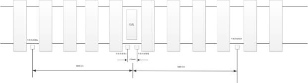
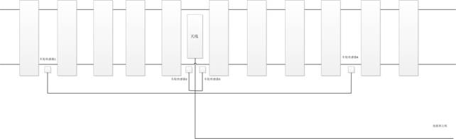
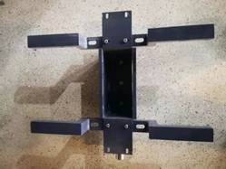
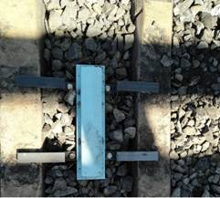
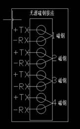

# 9. 安装调试

## 9.1. 开箱检查

打开包装箱后，与送货清单核对组件数量，并观察各组件外观是否有损坏。如发现损坏，请与我们联系。

## 9.2. 敷设射频电缆

为保证车号系统的识别效果，在敷设射频电缆时应注意以下事项：主机与天线间的射频电缆需要穿保护管（胶管，内径32mm或更大）敷设，不可直埋；射频识别系统对于防水要求较高，敷设时，应做好保护管接口和管口的防水处理，避免雨季进水；敷设时应注意不要划伤电缆外皮，以免受潮；敷设电缆时应避免直角弯，拐弯半径应大于20cm。

敷设电缆时同时将车轮传感器通信线缆（屏蔽3⨯0.5mm2）可以和天线线缆同时穿管敷设，车辆传感器通信线缆根据安装通信线缆的数量穿管即可。

- 下图为建议的安装示意图  
    
  图9-1 安装示意图

- 走线示意图如下图所示：  
    
  图9-2 走线示意图

## 9.3. 安装天线

天线安装方向与轨道垂直。天线须轻拿轻放，避免磕碰，如果产生裂纹易受潮损坏。需注意下雨后天线周围不会积水，浸泡。天线与射频电缆接头需上紧，接头处需要用防水胶带缠紧（如果使用防水胶泥，胶泥外需再缠一层防水胶带），需要在灰枕间安装的如下图介绍：

- (1) 线下安装

  第一步把上支架跟走水槽链接、安装第二步把射频天线安装到走水槽上，如下图所示：  
    
  图9-3线下安装图

- (2) 线上安装

  在选定安装天线的两条轨枕间，将道渣适量扒开至轨枕底部，在轨枕下插入安装件两根，方向与轨枕垂直，如下图所示：  
    
  图9-4 扒开道渣、轨枕底部安装件效果图

- (3) 把线下准备好的组合设备跟轨枕下的支架用螺丝固定，固定完成后将射频电缆连接头和射频天线出线头对接拧紧，用鲤鱼钳将天线接头紧固。  
  注意紧固时不能带动电缆连接部分旋转，然后接头处用防水胶带包裹好，防止水浸入，把固定好的射频线塞进走水槽中留为余量线方便以后更换。  
  维修如下图所示：  
    
  图9-5组合天线安装图

## 9.4. 安装车号主机

将射频电缆与车号主机连接并上紧，接头用防水胶带缠紧。将串口1或串口2（根据您使用的协议选择串口，具体参考`通讯协议`部分）与计算机联接并确认联接计算机的串口号，在调试过程中需要用到。确认插孔地线接地良好（车号主机是机壳接大地），插入电源线。

## 9.5. 安装车轮传感器

将车轮传感器安装于靠近车号机柜一侧的铁轨上，其中1号传感器与天线平行安装，2号传感器安装在1号传感器相邻的轨枕空隙中，3号传感器于1号传感器相距5米安装，4号传感器与2号传感器相距5米安装。其示意图如7-2。列车方向是根据列车如果先到达1号传感器或3号传感器，则列车为向左行驶；如果先到达2号传感器或4号传感器，则列车为向右行驶。其中如果需要识别机车标签，则需要3和4号磁钢，用于打开射频功放，如不需要机车标签，则不需要。1号传感器用于识别列车类型，如货车或者机车。2号传感器用于识别列车方向。

- 磁钢依其作用可将其分为开关机磁钢，计轴判辆磁钢（开门，关门磁钢对）其安装方法完全一样。磁钢安装示意图如下：  
    
  图 9-6 磁钢安装位置示意图

  L：磁钢外沿距离钢轨轨头内侧距离为73mm（通常为72-75毫米）；

  H：磁钢顶部距钢轨平面高度37~~39mm

  D1：2，1磁钢中心距维270mm

  3，4号磁钢的安装尺寸如图9-6中的长（L）和高（H）

**安装注意事项**

1. 安装磁钢时磁钢的安装尺寸一定要按照图9-6所标的尺寸安装。

2. 磁钢线接好后用绝源胶带和防水胶带包扎，封严，切勿使其外漏。

**车号后面****8****芯端子的定义**

1. 无源磁钢接线示意图：

     
   图9-7 无源车轮传感器接线示意图

## 9.6. 调试过程

在计算机上安装`标配车号识别系统V1.24`软件。（软件的安装和使用方法详见`配套软件`部分）。

打开车号主机电源，前面板`电源`指示灯亮。

运行`车号识别系统`软件。本软件在启动时会自动尝试连接车号识别系统主机。在启动软件前，请确认车号主机串口与计算机串口已联接好，车号主机与天线已联接好，车号主机电源开关已打开，并确认计算机的串口号与本软件配置文件（详见6.2）中的串口号相同。

软件启动后，显示程序主界面。

使用金属工具点击车轮传感器，右侧圆点变绿，说明功放成功打开，程序与车号主机通讯正常。此时车号主机前面板`功放`指示灯亮，液晶屏显示`功放打开`。 点击`功放关闭`按钮，右侧圆点变灰，说明功放关闭成功。此时车号前面板`功放`指示灯灭，液晶屏显示`功放关闭`。

在功放打开状态下，在天线上方刷标签，车号主机液晶屏显示当前收到的车号标签信息。如果连接的是车号主机的串口1，则在程序窗口文本框内可以显示读取标签的信息，包括20位标签内容和标签序号、每个标签的读取次数。此时车号主机面板发送指示灯闪烁。如果连接的是车号主机的串口2，则需点击`自动查询`按钮，程序循环发送`读取`和`确认`指令，文本框内显示读取标签信息中前14位信息（属性、车种、车型、车号）。此时车号主机前面板`接收`指示灯闪烁。

在功放关闭的状态下，点击`参数设置`按钮，弹出`车号主机参数设置`对话框，并自动读取当前的配置信息。修改并下载配置后，关闭`车号主机参数设置`对话框后，程序会自动检测当前的串口波特率。

## 9.7. 注意事项

- 车号主机、天线轻拿轻放，避免磕碰。

- 射频电缆必须穿防护管并注意防水。

- 射频电缆与天线、主机的接头必须缠防水胶带。

- 打开功放前必须确认车号主机与天线连接良好。

- 天线安装方向与轨道方向垂直（即与轨枕平行）。

- 电源插座地线接地良好。

- 串口线长度不易超过3米。