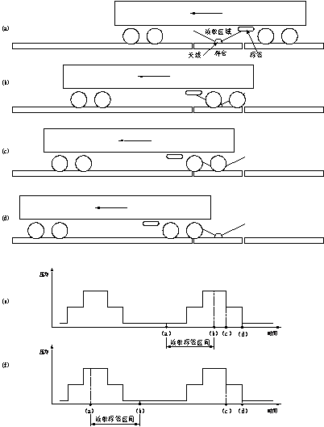
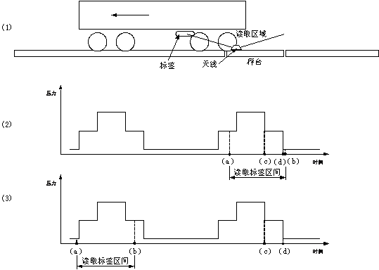

# 10. 结合轨道衡称重软件

BT-310型车号自动识别系统可以方便的与您的称重软件相结合。为了使车号识别系统与您的称重软件更好的配合，在这里描述一下车号读取区间与车轴、转向架经过称台的时续关系，说明了打开功放、关闭功放以及匹配称重数据与车号信息的时刻，并说明了在配匹配数据时应注意的事项。

## 10.1. 车号读取区间

图10-1中表示了称重波形与车号读取区间的关系。车号电子标签安装在车厢底部两转向架中间，并靠近其中一个转向架。图8-1中(a)~(e)为车号标签靠近后转向架时的情况， (a)图为车号标签进入读取区域的时刻。(b)图为车号标签移出读取区域的时刻。(c)图为第三轴下秤的时刻。(d)图为第四轴下秤的时刻。(e)图为秤重波形与车号读取区域间的关系图，图中abcd四点分别对应(a)~(d)图。(f)图为车号标签安架在靠近前转向架时秤重波形与车号读取区间的关系图。

  
图10-1　称重波形与车号识别区间的关系

## 10.2. 匹配车号数据的时刻

由图10-1可见，通常在c时刻或d时刻匹配车号数据均可。如果天线安装在秤台正中，则第四轴下秤时（d时刻）读取车号信息比较可靠，因为这时车号标签已完全通过读取区域。如果天线安装在秤台一侧，则第三轴下秤时（c时刻）读取车号信息比较可靠，在这个时刻读取，会损失一定的车号读取区间，但可以避免下一节的车号覆盖上一节车号的现象。在进行车号数据与称重数据进行匹配时，必须使用最新收到的车号数据，而且匹配后需要清空车号接收的缓冲区，这样可以避免车号窜位和重号现象。

通常，可以在程序中设置一个车号接收的缓冲区，每次收到新车号帧时覆盖旧的数据，这样可以确保每次用于匹配的车号是最新收到的车号。在读取数据后清区缓冲区，在读取匹配车号数据后与上一个车号进行比较，如果相同则舍弃。具体原因，请参考“关于重号”部分。

## 10.3. 功放开关控制

在轨道衡判断上称的时刻，向车号主机发送一次“功放打开”指令即可。车号主机从收到“功放打开”指令到可以接收车号数据的间隔很短（毫秒量级），在第一厢车的标签进入读取区域前有充足的时间，不必担心上秤时功放来不及打开。轨道衡判断列车已通过后，发送一次“功放关闭”指令即可。

## 10.4. 关于“重号”

如果您在使用过程中发现有重号现象，通常有以下几种可能：

### 10.4.1. 车号系统识出现漏读现象

是否出现漏读标签的现象比较容易确定。在车辆通过时观察车号主机面板液晶显示屏上每个标签的标签序号和读取次数（相关说明详见“人机界面”部分）。如果标签序号正确，且大多数标签读取次数大于10次，则漏读的可能性较小。如果标签序号小于列车数量，且多数标签读取次数少于5次，则可能出现漏读现象。

### 10.4.2. 有标签损坏或未装标签的车辆

是否属于这种情况可以观察液晶显示屏上每个标签的标签序号和读取次数。如果大多数标签读取次数大于10次，则说明车号识别系统工作正常，而标签损坏或未装标签的车辆的可能性较大。

### 10.4.3. 天线安装位置不合适

图10-2 天线安装位置变化时标签读取区间的变化

对于某些短车，和一些标签安装位置较高的车，b点可能位于c点之后，即在第三轴下秤后还有可能读取到标签信息。如果天线未安装在秤台正中，例如图10-2-(1)中偏向左侧，有时b点会位于d点之后，即向左行驶的车可能出现第四轴下秤后还可能读到标签数据，而向右行驶的车可能出现在第一轴上秤前即读到标签数据的情况，如图10-2-(3)。对于向左行驶的车辆，如果在第四轴下称时匹配并清除车号缓冲区，缓冲区清除后可能再次存入上一节车的标签数据。如果在收到新标签数据未覆盖旧数据，或在下次匹配标签数据时未使用最新的数据，或下一节车的标签异常的情况下，下一节车会出现重号现象。对于向右行驶的车辆，可能出现前一辆车第四轴还未下称时，已读取了下一节车的车号数据并覆盖了上一节车的车号数据，出现与前一节车重号的现象。

由以上分析可见，天线应尽可能安装在称台中间，否则会对称重软件的时序匹配产生影响。如果天线安装位置不居中，则在第三轴下秤时进行车号匹配比较可靠。