# 11. 标签编码

## 11.1. 机车电子标签FSK编码格式

机车电子标签中的20字节信息编码格式如表9-1所示。其中固定信息包括：属性（1）+机车型号（3）+机车编号（4）+配属段（4）+端码（1），共13位，可变信息包括：本/补（1），客/货（1）+车次（5），共7位。

- 表11-1 机车FSK电子标签编码格式  
  

## 11.2. 机车电子标签FS0编码格式

机车FS0电子标签中的20字节信息编码格式如表9-2所示。其中固定信息包括：属性（1）+双节状态（1）+机车编号（4）+配属局，段（4）+车型（3），共13位，可变信息包括：本/补（1），客/货（1）+车次（5），共7位 。

- 表11-2 机车电子标签编码格式  
  

## 11.3. 货车车辆电子标签信息编码格式

车辆电子标签中的20字节的信息编码格式如表11-3所示。

- 表11-3 车辆电子标签编码格式  
  

## 11.4. 客车车辆电子标签信息编码格式

客车车辆电子标签中的21字节的信息编码格式如表11-3所示。

- 表11-3 客车车辆电子标签编码格式  
  
