# 3. 按键菜单设置说明

## 3.1. 面板菜单介绍

- 面板菜单如下图所示：  
  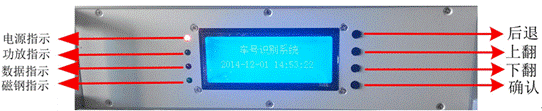  
  *图3-1 BT-310型车号识别系统主机前面板显示及按键说明*

  前面板包括指示灯、液晶显示、按键3个部分组成。

## 3.2. 波特率设置

- 打开主机，上电之后的液晶显示如下：  
  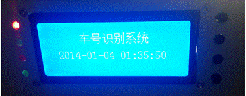  
  *图 3-2 液晶上电显示*

- ① 按下右侧最下方“确定”按钮，查看菜单：  
  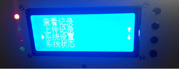  
  图 3-3 菜单显示

- ② 按下右方“下翻”按钮，向下选择到“系统设置”，按下“确认”键。  
  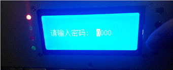  
  图 3-4 密码输入

- ③ 默认密码为“0000”，直接一直按“确认”，直到下一级，选择“设置波特率”。  
  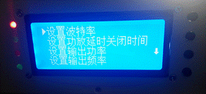  
  图 3-5 选择设置波特率

- ④ 点击“设置波特率”，查看波特率。  
  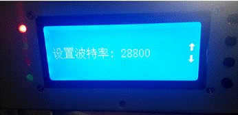  
  图 3-6 调节波特率

  此时看到的波特率为当前设置的波特率，需要修改时，按“上翻”、“下翻”按键，调节波特率，然后选择“确认”键，提示“波特率设置成功”，重新上电即波特率设置成功。

## 3.3. 功放延时设置

- ① 按下右侧最下方“确定”按钮，查看菜单：  
  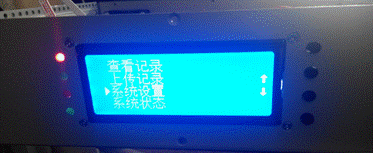  
  图 3-7 查看菜单

- ② 按下右方“下翻”按钮，向下选择到“系统设置”，按下“确认”键。  
  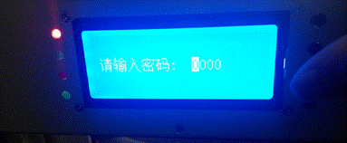  
  图 3-8 密码输入

  默认密码为“0000”，直接一直按“确认”，直到下一级，选择“设置功放延时关闭时间”。

- ③ 按右下方“上翻”、“下翻”按钮，调节功放关闭时间，调节完成后，按下“确认”键，会提示“功放关闭延时设置成功”。  
  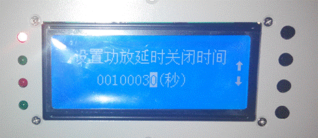  
  图 3-9 调节延时时间

- ④ 按“上翻”、“下翻”按钮，调节输出功率，调节完成时按下“确认”，会提示“输出功率设置成功”。

## 3.4. 输出功率设置

- ① 按下右侧最下方“确定”按钮，查看菜单：  
  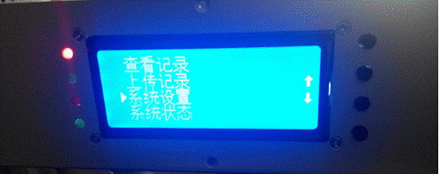
  图 3-10 查看菜单

- ② 按下右方“下翻”按钮，向下选择到“系统设置”，按下“确认”键。  
  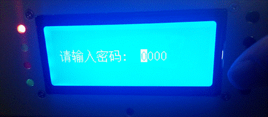  
  图 3-11 密码输入

  默认密码为“0000”，直接一直按“确认”，直到下一级，选择“设置输出功率”。

  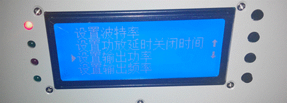
  图 3-12 选择设置输出功率

- ③ 按右下方“确认”按钮，进入输出功率设置界面。
  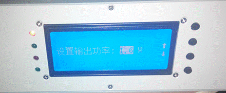
  图 3-13 调节输出功率

- ④ 按“上翻”、“下翻”按钮，调节输出功率，调节完成时按下“确认”，会提示“输出功率设置成功”。

## 3.5. 输出频率设置

- ① 按下右侧最下方“确定”按钮，查看菜单：  
  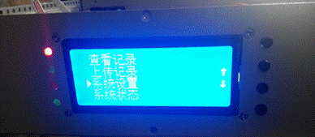  
  图 3-14 查看菜单

- ② 按下右方“下翻”按钮，向下选择到“系统设置”，按下“确认”键。  
  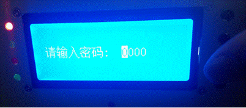  
  图 3-15 密码输入

  默认密码为“0000”，直接一直按“确认”，直到下一级，选择“设置输出频率”。

  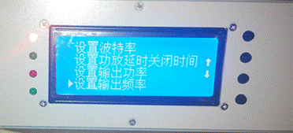  
  图 3-16 选择输入频率

- ③ 按右下方“确认”按钮，进入输出频率设置界面。  
  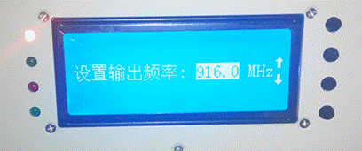  
  图 3-17 调节输出频率

  按“上翻”、“下翻”按钮，调节输出功率，调节完成时按下“确认”，会提示“输出频率设置成功”。

## 3.6. 设置传感器灵敏度

- ① 按下右侧最下方“确定”按钮，查看菜单  
  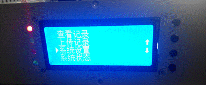  
  图 3-18 查看菜单

- ② 按下右方“下翻”按钮，向下选择到“系统设置”，按下“确认”键。  
  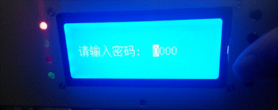  
  图 3-19 输入密码

  默认密码为“0000”，直接一直按“确认”，直到下一级，通过“下翻”按键选择“设置传感器灵敏度”。

  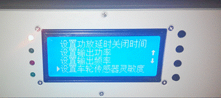  
  图 3-20 选择的设置传感器灵敏度

- ③ 按右下方“确认”按钮，进入设置传感器灵敏度界面。  
  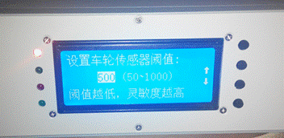  
  图 3-21 灵敏度调节

  按“上翻”、“下翻”按钮，调节阈值大小，调节完成时按下“确认”，会提示“阈值设置成功”。

## 3.7. 设置密码

- ① 按下右侧最下方“确定”按钮，查看菜单：  
  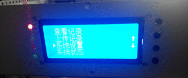  
  图 3-22 菜单查看

- ② 按下右方“下翻”按钮，向下选择到“系统设置”，按下“确认”键。  
  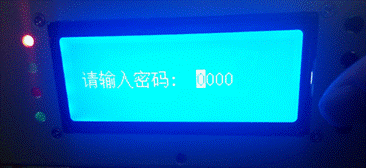  
  图 3-23 密码输入

  默认密码为“0000”，直接一直按“确认”，直到下一级，选择“设置密码”。

  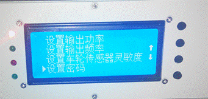  
  图 3-24 选择设置密码

- ③ 按右下方“确认”按钮，进入密码设置界面。  
    
  图 3-25 修改密码

  按“上翻”、“下翻”、“后退”、“确认”按钮，修改新旧密码，修改完成时按下“确认”，会提示“密码设置成功”。

## 3.8. 设置时间

- ① 按下右侧最下方“确定”按钮，查看菜单：  
  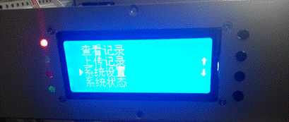  
  图 3-26 菜单查看

- ② 按下右方“下翻”按钮，向下选择到“系统设置”，按下“确认”键。  
  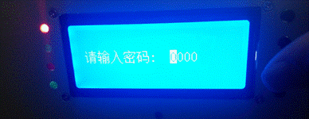  
  图 3-27 密码输入

  默认密码为“0000”，直接一直按“确认”，直到下一级，选择“设置时间”。

  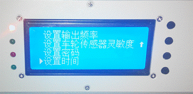  
  图 3-28 选择设置时间

- ③ 按右下方“确认”按钮，进入输出时间设置界面。  
    
  图 3-29 修改时间

  按“上翻”、“下翻”、“后退”、“确认”按钮，修改时间，修改完成时按下“确认”，会提示“时间设置成功”。

## 3.9. 功放开关控制

- ① 按下右侧最下方“确定”按钮，查看菜单  
  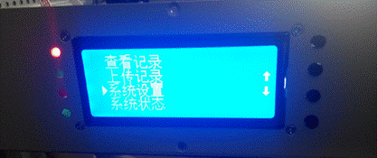  
   图 3-30 菜单查看

- ② 按下“下翻”键，找到“功放开关控制”  
  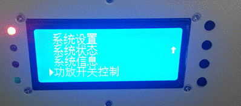  
  图 3-31 选择功放开关控制

- ③ 按下“确认”键，当功放打开时，液晶显示功放打开状态，左侧自上而下的第二个指示灯亮起。  
  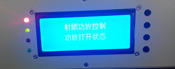  
  图 3-32 功放打开

- ④ 再按下“确认”键，当功放关闭时，液晶显示功放关闭状态，左侧自上而下的第二个指示灯处于灭灯状态。  
  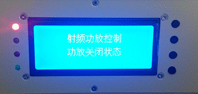  
  图 3-33 功放关闭
