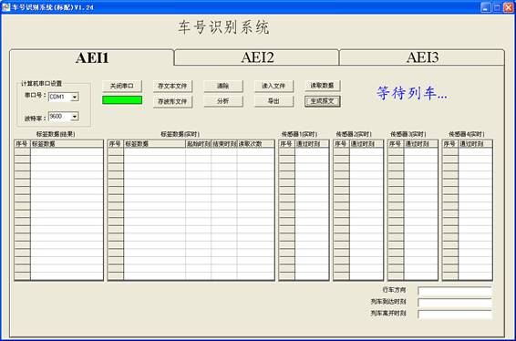
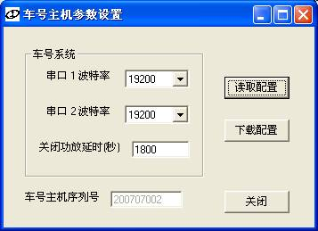
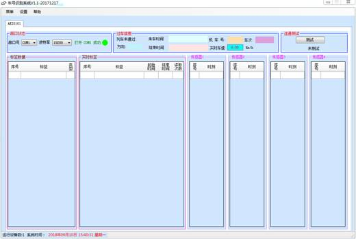
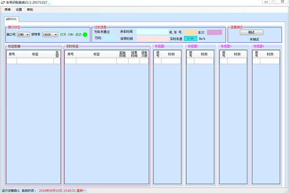
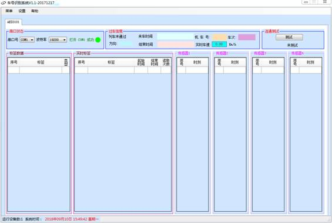
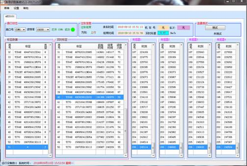

# 8. 配套软件

## 8.1. VB 软件

为方便您的使用和二次开发，本车号识别系统随机附送`标配车号识别系统V1.24`软件及源码。本软件提供了接收并显示接收到的车号标签信息和车轮通过车轮传感器的时间信息，并可以将收到的信息保存成文件。可以通过本软件方便的设置车号主机各个串口的波特率并存储在车号主机内，断电不丢失。本软件可以自动检测车号主机串口的波特率，如果您不清楚车号主机的波特率，可以通过本软件方便的进行测试。另外，本软件提供了自动查询功能，可以将最近一次过车的信息完成上传。软件能够识别列车到达和离开信息，识别列车通过方向。

本软件使用 VB6.0 开发完成的，提供源码，其中的函数、功能模块可以方便的嵌入您开发的系统之中，加快您工作的进程。

### 8.1.1. 软件安装

打开随机附带的光盘，双击`标配车号识别系统V1.24.exe`，按安装向导安装软件即可。默认安装路径`C:\Program Files\北铁高科\车号识别系统`。

### 8.1.2. 配置文件说明

软件安装后，在安装目录下有一个 `config.ini` 文件，是一个配置文件，保存了软件启动时的一些初始化选项。本文件是纯文本文件，可以用记事本打开编辑。

- 以下是默认配置文件的内容：

  ```ini
  [run]
  winState=0
  [AEI1]
  port=COM1
  baud=9600
  autoOpenPort=1
  autoSaveFile=1
  autoSaveWave=1
  outputType=1
  WheelSensorNum=4
  autoOpenPort=1
  上行方向=向右行驶
  判辆通道=1
  保存扩展信息=0
  进行轮轴匹配=1
  上行方向=向左行驶
  报文输出路径=c:\tran\
  rep报文文件名=chreport.rep
  车站电报略号=XYX
  地面AEI设备的站号=1
  ```
  

**参数解释**：

- port  
  表示程序启动时默认使用的计算机的串口号，如计算机串口1联接车号识别系统主机，则port=COM1；如果计算机的串口2联接车号识别系统主机，则port=COM2。注意：这里配置的是计算机使用的串口号，而不是车号主机使用的串口号，即如果用计算机的串口1联接车号主机的串口2，这里应配置为port=COM1。

- baud  
  表示程序启动时默认的波特率，可配置为2400、4800、9600、19200、28800、38400、57600、115200。

- autoOpenPort  
  表示程序启动时是否自动打开串口。如果需要自动打开，配置为true，否则配置为false。如果程序启动时，port选项所配置的串口已被其它应用程序打开，会弹出错误提示。

- autoSaveFile  
  表示在功放关闭时是否自动保存文件。如果需要自动保存，配置为true，否则配置为false。如果配置为true，则在每次功放关闭时将收到的标签信息保存成一个文本文件。文件保存在程序的安装目录下。

- winState  
  表示程序启动时窗口的状态，配置为0为正常显示，配置为1为最小化。

- AutoSaveWave  
  表示保存车轮通过时刻的波形信息，方便分析列车丢轴情况。

- outputType  
  表示保存报文的协议

- WheelSensorNum=4  
  表示安装车轮传感器的数量，有3和4个。

- 上行方向=向右行驶  
  表示上行方向对应的列车的左右方向，

- 判辆通道=1  
  表示用于识别列车类型的车轮传感器的标号，

- 保存扩展信息=0  
  表示需要显示车号标签的扩展信息，

- 进行轮轴匹配=1  
  表示是否进行列车类型的匹配，

- 报文输出路径=`c:\tran\`  
  表示生成报文的路径，

- rep报文文件名=`chreport.rep`  
  表示报文的名称，

- 车站电报略号=XYX  
  根据TIMS规定的车站的信息，

- 地面AEI设备的站号=1  
  表示车号设备的编号。

### 8.1.3. 使用说明

**(1) 功能简介**

- 车号识别系统的主界面如图9-1所示。  
    
  图8-1 车号识别系统程序

  在程序窗口左上方 `计算机串口设置` 中可以设置联接车号主机的计算机的串口号和波特率。程序启动时默认使用配置文件中配置的串口号和波特率（关于配置文件的详细说明，请参考9.2）。如果未在配置文件中正确的配置串口号，运行程序后可以更改。串口打开状态时，`串口号`和`波特率` 都是灰化的，需要先关闭串口才能更改。

  左上方第一个按钮为串口开关按钮，控制串口的开关。在串口打开状态下显示`关闭串口`，同时按钮下方方框为绿色。在串口关闭状态下显示`打开串口`，同时按钮左侧圆点为灰色。

  `保存文本`：表示是否保存过车的信息。

  `保存波形`：表示是否需要保存车轮传感器的过轴时间信息，方便使用ORIGIN软件进行分析。

  `清除`：表示清除列车在下面表里的文本。

  `分析`：根据车轮信息和标签的时间信息，识别列车的车型，匹配车号。

  `读入文件`：表示读取保存的车号信息文本，进行分析和观察。

  `导出`：表示导出车轴信息为port.txt。

  `读取数据`：表示将车号主机中保存的上次列车车号数据再次读取到当前系统中。

  `生成报文`：将车号信息生成报文。

  窗口中标签数据（实时）框用于显示接收到的车号信息，传感器1.2,3,4框显示车轴通过每个车轮传感器的时间信息，标签数据（结果）框用于显示列车通过后，识别列车车型后，车厢与标签的匹配情况，可以发现是否丢失标签。

**(2) 参数设置**

- 点击·参数设置`按钮`，可以打开`车号主机参数设置`对话框，如图6-2所示。车号主机串口1或串口2均可进行参数设置。
    
  图8-2 车号主机参数设置对话框

  在打开此对话框时，程序会自动读取当前车号主机的参数设置。如果读取成功，会弹出`参数读取成功`的对话框。此对话框有`读取配置`、`下载配置`和`关闭`三个按钮。

  点击`读取配置`按钮，程序通过串口向车号主机发送读取配置指令，若读取成功，弹出`参数读取成功`对话框，否则弹出`等待时间超时`对话框。

  参数设置对话框中`车号系统`框中串口1、串口2为车号主机串口1、串口2的波特率。可以在下拉列表框中选择想要设置的波特率。`关闭功放延时`中可以设置从功放打开到功放自动关闭的时间间隔，单位为秒，可设置的范围1~2000000000秒。

  点击`下载配置`按钮可以下载和保存串口1、串口2的波特率配置，并随后发出`复位指令`，复位车号主机。车号主机复位后，所设置的串口通讯速度立即生效。主机复位后，`读取配置`和`下载配置`按钮灰化。

  对话框下方显示`车号主机序列号`，这台车号主机的序列号。序列号仅为方便厂家作产品标识和记录。

## 8.2. C#版软件说明

### 8.2.1. 软件安装

本软件为绿色版，将软件文件拷贝到处理计算机上，将文件夹中的`车号识别系统.exe`添加到桌面和启动项即可。需要注意的是软件在运行时如果打不开的话需要安装运行时，可询问厂家索取。

- 软件打开后的界面如下图所示：  
    
  图8-3 C#版软件打开界面

### 8.2.2. 配置文件说明

- 打开`config.ini`文件，主要配置信息包括：

  ```
  [COMAEIInfo]
  AEINum=1
  ```

  AEINum为串口型设备的数目，如配置AEINum=1，软件界面如下：

    
  图8-4 C#版软件管理效果图

  串口型AEI设备的详细配置信息

  ```ini
  [COMAEI0]
  ID=AEI0101   //AEI的ID，可不修改
  LocalName=AEI0101   //安装地点名称
  
  #创建文件的标志,1zjb,2,创建Rep文件,文件名:chreport.rep,3，大连齐辉的报文,txt文件,5 电子三所,6，dat文件；7水运规划院,8,D报文，9，长春，10，本溪处理机车数据，
  #11，zjb加sms（东方瑞威，方向，上行为0，下行为1），12，MySQL数据库操作
  
  CreatePackFlag=5   //以上标志位为客户定制的报文格式
  FileSavePath=C:\ch   //保存的文件路径
  FileSaveName=D.zjb  //保存的文件名
  BackSavePath=BakFile  //备份文件路径
  AEIType=COM     //AEI类型
  ComPort=1       //串口号
  Buardrate=19200    //波特率
  Channel=1       //股道号
  DefaultInstallOrder=1482 //磁钢安装顺序，按照本说明顺序安装，可不用修改配置
  #注：车轮传感器
  
  EnableJudgeDir=1    //是否判断方向
  DefaultDir=上行    //安装顺序为DefaultInstallOrder的顺序时的方向，支持`上行`、`下行`、`出库`、`入库`几个配置，和DefaultInstallOrder相对应。
  DefaultDirFlag=0   //当前配置配置的方向标志，软件运算和当前反向时为1
  EnabelCalSpeed=1  //是否计算速度
  CiGDistance=270   //计算速度时两个车轮传感器的安装距离。
  ```

### 8.2.3. 使用说明

- 打开软件界面，如下图  
    
  图8-5 C#版软件界面

  打开串口失败时，串口状态为图标为红色，请重新修改配置软件中串口号，或查看串口是否被占用，当有机车通过时，过车状态会提示`机车通过`、并显示到达时刻，在过车经过一段时间后，会给出过车方向，在过车结束时，会提示离开时刻。

  在过车时，传感器1到4会给出每个车轮传感器在车辆经过时相对于第一个车辆过去时时刻（记录时间为0）的相对时刻依次记录时间，序号数为记录传感器激发的次数。

  实时标签数据显示的是当前收到的标签数。

  标签数据显示的是在过车结束时根据轴距信息推算的标签信息，如果标签损坏无法读取时，会在相应的车厢位置标记为`*`。

  实际过车处理效果如图所示：

    
  图8-6 C#版软件过车处理效果