# 大秦铁路接发车系统 - 车号设备信息


## 1. 通讯协议

> BT-510 的通讯协议，不兼容 BT-310 的通用部分，从 4 代开始，放弃了针对 通用 通讯的支持。

### 1.1 工作流程

- 在本通讯协议下，车号识别系统的工作流程如图：  
  本协议对车号用户系统的CPU资源消耗较小。车号系统在收到车号标签信息后立即上传。  
    
  图2 车号系统工作流程（通讯协议)

### 1.2 打开功放

- 上位机发送

  ```
  @on&
  ```

- 上位机接收

  ```
  @on&
  ```

### 1.3 关闭功放

- 上位机发送

  ```
  @off&
  ```

- 上位机接收

  ```
  @off&
  ```

### 1.4 标签数据

- 下位机发送

  ```
  @********************AAAAAA&
  ```

  第一段数据：`********************`，20位为标签信息

  第二段数据：`AAAAAA`，6位为读取标签时刻，16进制ASCII码，“000000”~“FFFFFF”，单位ms。

- 例：

  ```
  @TC64K  494725512M042004C2A&
  @TC64K  494725512M042004C44&
  @TC64K  494725512M042004C51&
  @TC64K  494725512M042004C77&
  @TC64K  494725512M042004CC4&
  @TC64K  494725512M042004CD1&
  @TC64K  494725512M042004CF1&
  ```


### 1.5 查询状态

- 上位机发送  

  ```
  [getCfg]
  ```

- 上位机接收  

  ```
  [cfg=19200,9160,16,60]
  ```

  ※ 波特率、频点、功率、延时时间

## 2. 标签编码

### 2.1 机车FSK编码格式

机车电子标签中的`20`字节信息编码格式如表9-1所示。

其中固定信息包括：属性（1）+机车型号（3）+机车编号（4）+配属段（4）+端码（1），共13位，可变信息包括：本/补（1），客/货（1）+车次（5），共7位。

- 表11-1 机车FSK电子标签编码格式  
  

### 2.2 机车FS0编码格式

机车FS0电子标签中的`20`字节信息编码格式如表9-2所示。

其中固定信息包括：属性（1）+双节状态（1）+机车编号（4）+配属局，段（4）+车型（3），共13位，可变信息包括：本/补（1），客/货（1）+车次（5），共7位 。

- 表11-2 机车电子标签编码格式  
  

### 2.3 货车编码格式

车辆电子标签中的`20`字节的信息编码格式如表11-3所示。

- 表11-3 车辆电子标签编码格式  
  
- 车种  
  货车车辆的种类。正常货车车厢常用一个字母代表其车辆种类，这也叫做车种编码，例如C代表敞车，P代表棚车，N代表平板车，G代表罐车，L代表粮食车，X代表集装箱平板车，D代表长大货物列车，W是毒品车，等等。当然，也存在特例，用两个字母来代表的，GQ也是油罐车，NX也是平板车。
- 车型  
  货车车辆的类型。表示不同车型的车型编码由三部分组成，第一部分是车种编码，也是刚才所说的表明车辆种类的字母；第二部分是重量编码，表明货车车辆的载重量，正常是一个两位数数字，例如62、64、70等等；第三部分是结构编码，表明车辆的材质或者结构的不同，用一个字母或者两个字母表示，例如K代表车辆所用的转向架是K2转向架，H代表车辆所用的转向架是K4转向架，等等。
- 车号  
  相当于车辆的身份证号码。货车车辆的车号是7位数，客车车辆的车号是6位数。铁路也有明确的规定，不同区段的车号代表不同的车型，例如C64K货车车号多为48开头的车号，而C70E多为17开头的车号，等等。

### 2.4 客车编码格式

客车车辆电子标签中的`21`字节的信息编码格式如表11-4所示。

- 表11-4 客车车辆电子标签编码格式  
  


## 3. 车辆种类代号

### 3.1 铁路车辆代码

- 客车

  |  #   | 车种   | 代号 | 备注 |
  | :--: | ------ | ---- | ---- |
  |  1   | 软座车 | RZ   |      |
  |  2   | 硬座车 | YZ   |      |
  |  3   | 软卧车 | RW   |      |
  |  4   | 硬卧车 | YW   |      |
  |  5   | 行李车 | XL   |      |
  |  6   | 邮政车 | UZ   |      |
  |  7   | 餐车   | CA   |      |
  |  8   | 公务车 | GW   |      |
  |  9   | 卫生车 | WS   |      |

- 货车

  |  #   | 车种               | 代号 | 常见车型                          | 备注                                                     |
  | :--: | ------------------ | ---- | --------------------------------- | -------------------------------------------------------- |
  |  1   | 敞车               | C    | C62K、C70、C80等                  | 可装运不怕湿的货物，如装货后苫盖蓬布也可装运怕湿货物     |
  |  2   | 棚车               | P    | P62、P64、P70等，以及特殊的PB车型 | 用于装运贵重怕湿货物                                     |
  |  3   | 平车               | N    |                                   | 主要用于装运钢轨、汽车、拖拉机、军用物资及长大、笨重货物 |
  |      | 平板车             | NX   |                                   |                                                          |
  |  4   | 罐车               | G    | G17、G60、G70等                   | 专门用于装载液体状态的货物                               |
  |      | 油罐车             | GQ   |                                   |                                                          |
  |  5   | 保温车             | B    | B19、B20、B21等                   | 冷藏车：主要用于装运易腐货物                             |
  |  6   | 集装箱专用平车     | X    | X70、X6K等                        |                                                          |
  |  7   | 矿石车             | K    |                                   |                                                          |
  |  8   | 长大货物车         | D    |                                   |                                                          |
  |  9   | 毒品车             | W    |                                   |                                                          |
  |  10  | 粮食车             | L    |                                   |                                                          |
  |  11  | 家畜车             | J    |                                   | 用于装运牛、猪等家禽                                     |
  |  11  | 商品汽车专用运输车 | JSQ  | 常见车型：JSQ3、JSQ4、JSQ6        |                                                          |

### 3.2 车辆属性码

- 属性码

  |  #   | 属性码 | 车辆类型   | 列举                                                         | 备注           |
  | :--: | ------ | ---------- | ------------------------------------------------------------ | -------------- |
  |  1   | K      | 客车       | K11 大型普通客车；<br />K12 大型双层客车<br />K13 大型卧铺客车<br />K14 大型铰接客车；<br />K15 大型越野客车；<br />K21 中型普通客车；<br />K22 中型双层客车；<br />K23 中型卧铺客车；<br />K24 中型铰接客车<br />K25 中型越野客车<br />K31 小型普通客车；<br />K32 小型越野客车；<br />K33 轿车；<br />K41 微型普通客车；<br />K42 微型越野客车；<br />K43 微型轿车。 | 列举其中一部分 |
  |  2   | H      | 货车       | H11 重型普通货车<br />H12 重型厢式货车；<br />H13 重型封闭货车<br />H14 重型罐式货车<br />H15 重型平板货车<br />H16 重型集装箱车<br />H17 重型自卸货车<br />H18 重型特殊结构货车<br />H21 中型普通货车；<br />H22 中型厢式货车<br />H23 中型封闭货车<br />H24 中型罐式货车<br />H25 中型平板货车<br />H26 中型集装箱车<br />H27 中型自卸货车<br />H28 中型特殊结构货车<br />H28 中型特殊结构货车；<br />H31 轻型普通货车；<br />H38 轻型特殊结构货车；<br />H41 微型普通货车；<br />H46 微型特殊结构货车；<br />H51 低速普通货车。 | 列举其中一部分 |
  |  3   | Q      | 牵引车     | Q11 重型半挂牵引车；<br />Q21 中型半挂牵引车；<br />Q31 轻型半挂牵引车。 | 只有三个       |
  |  4   | Z      | 专项作业车 | Z11 大型专项作业车；<br />Z21 中型专项作业车；<br />Z31 小型专项作业车；<br />Z41 微型专项作业车<br />Z51 重型专项作业车<br />Z71 轻型专项作业车 | 列举其中一部分 |
  |  5   | D      | 电车       | D11 无轨电车；<br />D12 有轨电车。                           | 只有两个       |
  |  6   | M      | 摩托车     |                                                              |                |
  |  7   | N      | 农用车     | N11三轮农用运输；<br />N21四轮农用普通货车；<br />N22四轮农用厢式货车；<br />N23四轮农用罐式货车；<br />N24四轮农用自卸货车。 |                |
  |  8   | T      | 拖拉机     |                                                              |                |
  |  9   | J      | 轮式机械车 |                                                              |                |

### 3.3 铁路货车车型

- 新型铁路货车车型汇总

  | 车辆属性         | 车型   | 车型说明                             |
  | ---------------- | ------ | ------------------------------------ |
  | C 敞车           | C80    | 铝合金运煤敞车                       |
  |                  | C80A   | 全钢运煤敞车                         |
  |                  | C80B   | 不锈钢运煤敞车                       |
  |                  | C80C   | 全钢运煤敞车                         |
  |                  | C70    | 通用敞车                             |
  |                  | C70A   | 运煤敞车                             |
  |                  | C70B   | 不锈钢通用敞车                       |
  |                  | C100   | 载重100t三支点矿料、钢材运输专用敞车 |
  |                  | C100A  | 三支点运输矿料、钢材专用敞车         |
  | P 棚车           | P70    | 通用棚车                             |
  |                  | P70A   | 活动侧墙棚车                         |
  | G 罐车           | GQ70   | 轻油罐车                             |
  |                  | GN70   | 粘油罐车                             |
  |                  | GS70   | 浓硫酸罐车                           |
  |                  | GJ70   | 液碱罐车                             |
  |                  | GF70   | 氧化铝粉罐车                         |
  |                  | GQ70A  | 对二甲苯罐车                         |
  |                  | GHA70  | 醇类罐车                             |
  |                  | GH70A  | 乙二醇罐车                           |
  |                  | GH70B  | 冰醋酸罐车                           |
  |                  | GHB70  | XX罐车                               |
  |                  | GU70   | 散装水泥罐车                         |
  |                  | GHA70A | 对二甲苯罐车                         |
  |                  | GL70   | 沥青罐车                             |
  | N 平车           | NX70   | 共用车                               |
  |                  | NX17   | 共用集装箱平车                       |
  |                  | NP70   | 带活动棚钢卷运输专用车               |
  | K 矿车           | KM70   | 煤炭漏斗车                           |
  |                  | KZ70   | 石渣漏斗车                           |
  |                  | KM70A  | 底开门运煤专用车                     |
  |                  | KM70B  | 不锈钢煤炭漏斗车                     |
  | X 集装箱专用平车 | X2K    | 集装箱专用平车                       |
  |                  | X4K    | 集装箱专用平车                       |
  |                  | X6K    | 集装箱专用平车                       |
  | ??(J)            | SQ5    | 双层运输汽车专用车                   |
  |                  | JSQ4   | 双层汽车运输车                       |
  |                  | JSQ4K  | 双层汽车运输车                       |
  |                  | JSQ5   | 双层运输汽车专用车                   |
  |                  | JSQ6   | 凹底双层运输汽车专用车               |
  | T 特种           | T11BK  | 长钢轨运输车                         |
  | D 长大货物车     | DL1    | 大吨位预制XX运输专用车组             |
  |                  | D38    | 380t钳夹车                           |
  |                  | DQ35   | 350t钳夹车                           |
  |                  | D45    | 450t落下孔车                         |
  |                  | D32    | 320t凹底平车                         |
  |                  | D32A   | 320t凹底平车（特种）                 |
  |                  | D9A    | 90t凹底平车                          |
  |                  | D15A   | 150t凹底平车                         |
  |                  | D15B   | 150t凹底平车                         |
  |                  | D28    | 280t凹底平车                         |
  |                  | D26A   | 组合式XX平车                         |
  |                  | D22A   | 120t XX平车                          |
  |                  | D30G   | 370t双联平车                         |
  
  
