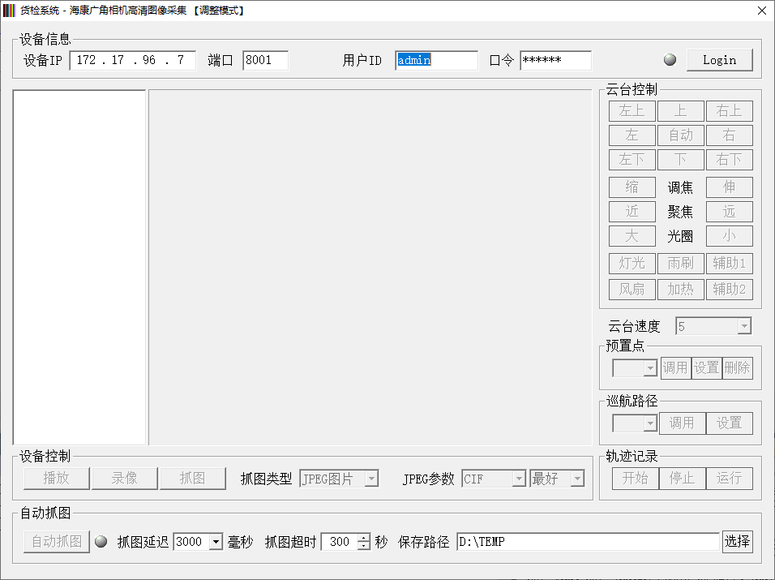
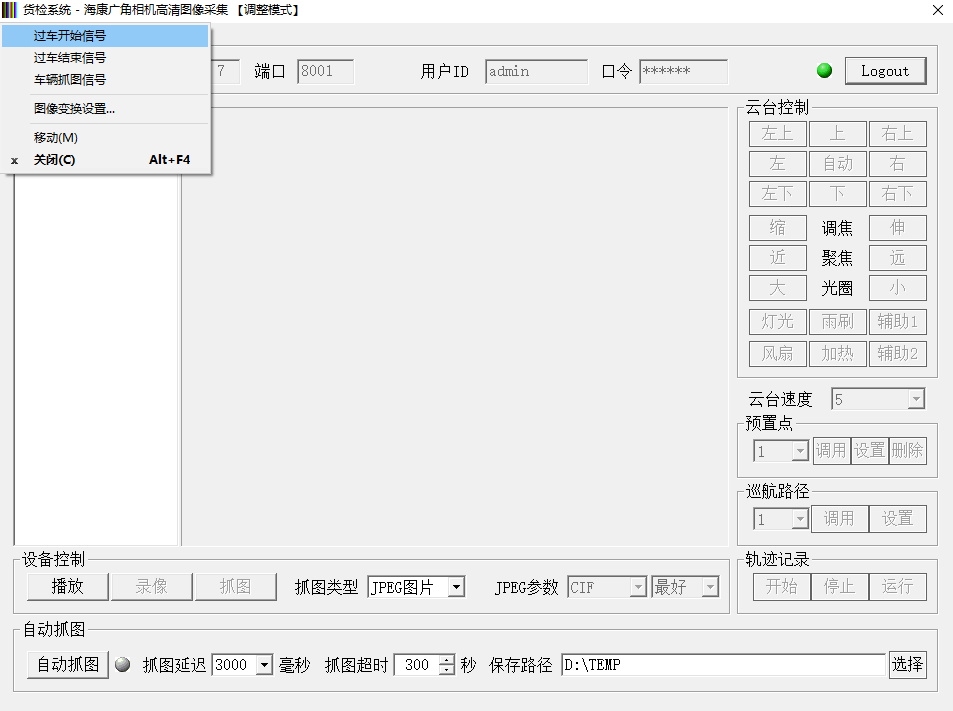

# 海康广角相机高清抓图

## 1.画面项目设置

- 启动画面【调整模式】

  
  
- 项目设置

  | 项目             | 类型   | 单位 | 说明                                                       | 是否必须设置 | 默认值    |
  | ---------------- | ------ | ---- | ---------------------------------------------------------- | ------------ | --------- |
  | 设备IP           | IP格式 | -    | 设备的IP地址                                               | 必须         | -         |
  | 端口             | 数字   | -    | 数字                                                       | 必须         | 8000      |
  | 用户ID           | 字符串 | -    | 设备登录用户名                                             | 必须         | admin     |
  | 口令             | -      | -    | 设备登录用户口令                                           | 必须         | 12345     |
  | 抓图类型         | -      | -    | 保存图像文件的类型（自动抓图的时候，固定为 JPG 格式）      | -            | -         |
  | JPEG参数（尺寸） | -      | -    | 保存图像文件的尺寸（自动抓图的时候，不受该参数影响）       | -            | -         |
  | JPEG参数（画质） | -      | -    | 保存图像文件的画质（自动抓图的时候，受到该参数影响）       | 必须         | 0（最好） |
  | 抓图延迟         | 数字   | 毫秒 | 接收到抓图信号之后的延迟时间                               | 必须         | -         |
  | 抓图超时         | 数字   | 秒   | 抓图之后，指定时间内没有再次接收到抓图信号的话，关闭画面面 | 必须         | -         |
  | 保存路径         | 字符串 | -    | 抓图之后的 JPG 文件保存路径                                | 必须         | -         |
  
  

## 2.隐藏项目设置

部分参数，属于隐藏项目，如果要修改的话，请在配置文件的相应区块里面设置。

- 隐藏项目

  | 区块入口名称 | 类型 | 单位 | 说明                                                      | 是否必须项目 | 默认值 |
  | ------------ | ---- | ---- | --------------------------------------------------------- | ------------ | ------ |
  | `LGN_TIM`    | 数字 | 秒   | 自动模式启动之后，等待该时间后，执行 `登录` 功能。        | 可省略       | 1      |
  | `LGN_MAX`    | 数字 | 秒   | 指定时间内，一直无法正确 `登录` 的话，关闭画面（重启）。  | 可省略       | 600    |
  | `CAR_PAS`    | 数字 | 秒   | 指定之间内，重复接收到 `抓图` 信号的话，认为是 `误信号`。 | 可省略       | 1      |

  

## 3.自动登录测试

启动模式的话，画面启动之后，会自动指定 `登录` 动作。  

- 登录正常的话，`登录` 按钮左侧状态灯，显示 `绿色`；
- 登录失败的话，`登录` 按钮左侧状态灯，显示 `红色`；
- 未登陆的话，`登录` 按钮左侧状态灯，显示 `灰色`。

登录测试续作如下测试：

1. 设备连接正常，应该能够正常登录。
2. 设备连接异常，登录失败，状态灯显示 `红色`。
   - 系统会重新尝试连接，在设定超时（默认 10 分钟）期间恢复连接的话，能够恢复正常登录 （默认登录失败 10 秒之后，再次尝试登录）。
   - 在设定超时（默认 10 分钟）期间，一直没有恢复设备连接的话，画面会被重新启动。

## 4.自动抓图测试

- 启动模式画面

  

  ※ 登录按钮做的的状态灯显示 `绿色` （正常登录）。

  系统菜单内，包含如下项目

  | 系统菜单项目    | 说明                                                         | 备注 |
  | --------------- | ------------------------------------------------------------ | ---- |
  | 过车开始信号    | 模拟过车开始信号，该信号会检测是否是正常登录状态，如果未登录的话，执行 `登录` 动作。 |      |
  | 过车结束信号    | 模拟过车结束信号，接收到该信号之后，如果已经存在 `抓图` 动作，会关闭本画面（重启）。 |      |
  | 车辆抓图信号    | 模拟抓图信号，接收到该信号之后，在设置的 `抓图延迟` 时间之后，执行 `抓图` 动作。 |      |
  | 图像变换设置... | 启动图像变化设置画面，`抓图` 成功之后，会调用变换功能，变换成功之后，上传到服务器。 |      |

- 测试项目

  1. 设备连接正常的话，验证能否正常 `抓图` ？

  2. 设备连接正常之后，主动断开设备连接，能够发现设备异常？

     异常情况下，恢复设备连接，`抓图` 能够成功？

  3. 断开连接的情况下，模拟发送 `过车开始信号`，是否能够重新登录？

  4. 模拟发送 `车辆抓图信号` 信号之后，能够正常 `抓图` ？

  5. 进行几次正常抓图之后，模拟发送 `车辆抓图信号` 信号，画面是否关闭（重启）？

  6. `抓图` 之后，能够变换为设置的图像格式？

## 5.画像变换设置

> 开发状态，尚未正常链接。
