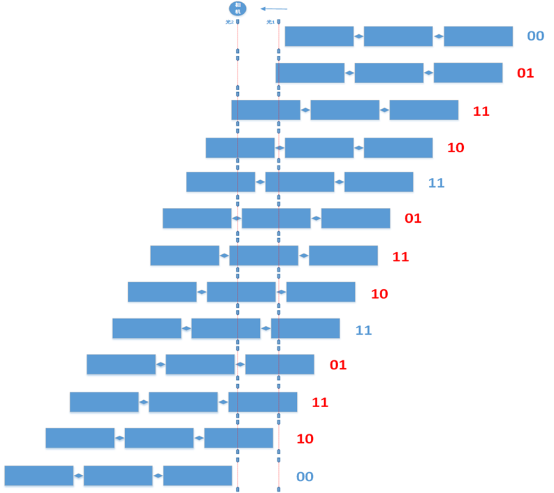

# 光电开关采集逻辑

## 1. 背景介绍

敬业站的作业线，使用光电开关控制相机拍照时刻；设置了 2 个光电开关，它们正好传送 10 信号（前面信号为 1，后面信号为 0）的时刻，进行抓拍。

## 2. 原理图

- 原理图  
  

## 3. 原理说明

- 说明

  | 序号 | 光电2 | 光电1 | 状态                   | 动作1     （正视图） | 动作2     （钩档图） |
  | ---- | ----- | ----- | ---------------------- | -------------------- | -------------------- |
  | 1    | 0     | 0     | 无车                   |                      |                      |
  | 2    | 0     | 1     | 一节车开始             |                      | 抓拍                 |
  | 3    | 1     | 1     | 前半节途中             |                      |                      |
  | 4    | 1     | 0     | 车辆中间               | 抓拍                 |                      |
  | 5    | 1     | 1     | 后半节途中             |                      |                      |
  | 6    | 0     | 1     | 本节车结束，下节车开始 |                      | 抓拍                 |
  | 7    | 1     | 1     | 前半节途中             |                      |                      |
  | 8    | 1     | 0     | 车辆中间               | 抓拍                 |                      |
  | 9    | 1     | 1     | 后半节途中             |                      |                      |
  | 10   | 0     | 1     | 本节车结束，下节车开始 |                      | 抓拍                 |
  | 11   | 1     | 1     | 前半节途中             |                      |                      |
  | 12   | 1     | 0     | 车辆中间               | 抓拍                 |                      |
  | 13   | 1     | 1     | 后半节途中             |                      |                      |
  | 14   | 0     | 1     | 本节车结束，下节车开始 |                      | 抓拍                 |
  | 15   | 1     | 1     | 前半节途中             |                      |                      |
  | 16   | 1     | 0     | 车辆中间               | 抓拍                 |                      |
  | 17   | 1     | 1     | 后半节途中             |                      |                      |
  | 18   | 0     | 1     | 本节车结束，下节车开始 |                      | 抓拍                 |
  | 19   | 1     | 1     | 前半节途中             |                      |                      |
  | 20   | 1     | 0     | 车辆中间               | 抓拍                 |                      |
  | 21   | 0     | 0     | 过车结束               |                      |                      |

  1. 多抓拍的情况是钩档在光电1的位置缓慢移动后停止，造成出现10抓拍信号后，又反复出现11 10信号，造成此节车重复抓拍。
  2. 为此可设定依次接收到01 11 10 三个车位信号后，判定抓拍；期间收到其他信号全部过滤掉。
  3. 车位程序的更新需要到现场操作，为了便于后续问题的优化，建议在车位数据解析端修改图像抓拍的逻辑。