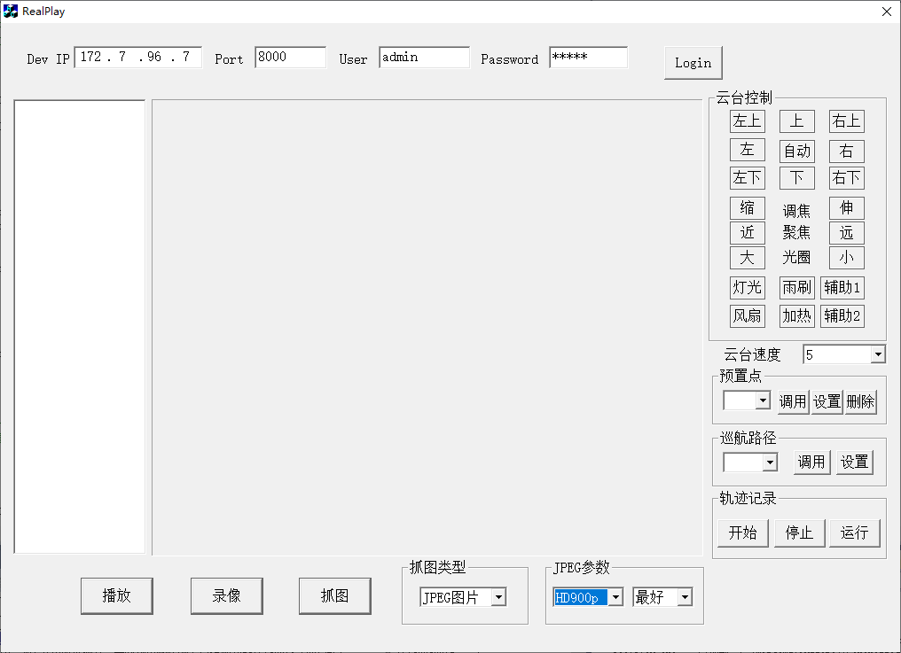

# 关于海康广角相机的图像抓取


## 1.使用SDK版本

> CH-HCNetSDKV6.1.9.47_build20221111_win64_20221216145359  
>
> 本机保存位置：`G:\海康相机SDK-广角`  
>
> - 相关模块  
>   1- 实时预览&抓图&云台控制

## 2.抓图程序画面

- 程序启动画面  
  

  从画面看，能够抓取的最好画质是 `HD900p`，其大小是 `1600x912`，所以明显是不符合要求的。  
  所以必须选择采集 `BMP` 图像，看看是否能够采集到更高分辨率的图像。

- 抓图代码  
  
  ```C++
  void CRealPlayDlg::OnButtonCapture() 
  {
  	if(m_lPlayHandle == -1)
  	{
  		MessageBox("请先选择一个通道播放");
  		return;
  	}
  	UpdateData(TRUE);
  
  	char PicName[256] = {0};
  	
  	int iPicType = m_coPicType.GetCurSel();
  	if(0 == iPicType)  //bmp
  	{
  		CTime CurTime = CTime::GetCurrentTime();;
  		sprintf(PicName,"%04d%02d%02d%02d%02d%02d_ch%02d.bmp",CurTime.GetYear(),CurTime.GetMonth(),CurTime.GetDay(), \
  			CurTime.GetHour(),CurTime.GetMinute(),CurTime.GetSecond(),m_struDeviceInfo.struChanInfo[GetCurChanIndex()].iChanIndex);
  	
  		if(NET_DVR_CapturePicture(m_lPlayHandle,PicName))
  		{
  			MessageBox("抓图成功!");
  		}
  	}
  	else if(1 == iPicType)  //jgp
  	{
  		CTime CurTime = CTime::GetCurrentTime();;
  		sprintf(PicName,"%04d%02d%02d%02d%02d%02d_ch%02d.jpg",CurTime.GetYear(),CurTime.GetMonth(),CurTime.GetDay(), \
  			CurTime.GetHour(),CurTime.GetMinute(),CurTime.GetSecond(),m_struDeviceInfo.struChanInfo[GetCurChanIndex()].iChanIndex);
  	
  		//组建jpg结构
  		NET_DVR_JPEGPARA JpgPara = {0};
  		JpgPara.wPicSize = (WORD)m_coJpgSize.GetCurSel();
  		JpgPara.wPicQuality = (WORD)m_coJpgQuality.GetCurSel();
  
  		LONG iCurChan = m_struDeviceInfo.struChanInfo[GetCurChanIndex()].iChanIndex;
  
  		if(NET_DVR_CaptureJPEGPicture(m_struDeviceInfo.lLoginID, iCurChan, &JpgPara, PicName))
  		{
  			MessageBox("抓图成功");
  		}
  	}
  	
  	return;	
  }
  ```
  
  `NET_DVR_CapturePicture(m_lPlayHandle,PicName)` 中使用到 `m_lPlayHandle` 变量，只有在 `播放` 按钮点击之后才给赋值。  
  
  ```c++
  void CRealPlayDlg::StartPlay(int iChanIndex)
  {
  	NET_DVR_CLIENTINFO ClientInfo;
  	ClientInfo.hPlayWnd	 = GetDlgItem(IDC_STATIC_PLAY)->m_hWnd;
  	ClientInfo.lChannel	 = m_iCurChanIndex+1;
  	ClientInfo.lLinkMode	= 0;
  	ClientInfo.sMultiCastIP = NULL;
  	TRACE("Channel number:%d\n",ClientInfo.lChannel);
  	m_lPlayHandle = NET_DVR_RealPlay_V30(m_struDeviceInfo.lLoginID,&ClientInfo,NULL,NULL,TRUE);
  	if(-1 == m_lPlayHandle)
  	{
  		DWORD err=NET_DVR_GetLastError();
  		CString m_csErr;
  		m_csErr.Format("播放出错，错误代码%d",err);
  		MessageBox(m_csErr);
  	}
  
  	m_bIsPlaying = TRUE;
  	GetDlgItem(IDC_BUTTON_PLAY)->SetWindowText("停止播放");
  
  }
  ```
  
  所以，从代码看，好像是必须开始 `播放` 之后，才能够执行 `抓图` 功能，这个也要测试一下。  
  如果确实这样的话，确实非常麻烦。估计必须直接和相机连接，才能够采集到更高画质的图像。
  
- 多通道同时抓图  
  从代码看，单纯程序执行是保存结束才能返回，所以 如果要多通道同时抓图的话，会存在时间差，对于运行中的车辆，不能采取这种模式。  
  应该采用多线程模式，但是因为相机不在我手边，估计会采用多进程模式，这样开发起来相对简单（单纯）一些，大概率可以通过大脑抽象就可以解决。


## 3.抓图测试结果

- `播放` 开始之后，才能够 `抓图`。

- 抓图的尺寸和画面上的设置参数没有关系。
  通过 `NVR` 抓图的话是否有影响，还需要测试。如果 NVR 无法保证画质的话，那么 NVR 方案就不可用。

- 直连相机的话，画面上左侧应该只会显示一个通道。
  预想：只有连接 NVR 的时候，才可能出现多个通道的情况。

- 画质很高的话，实时显示图像比较耗费 CPU。

  预计采用如下处理：

  - 得到来车信号之后，开启图像 `播放`；

  - 得到车辆钩档的信号之后，延迟一定时间，进行 `抓图` 处理；

  - 车辆通过之后，关闭实时播放，减轻 CPU 利用率。

    是否有车辆通过，可以通过光电开关信号判断，如果无法判断，根据钩档信号之后 `20` 秒之后没有钩档信号，作为过车结束信号。

## 4.现场注意事项

　现场作业注意事项如下：

- 钩档判断的光电开关设备场所，在相机抓怕的前面，要保证有一定的余量。

- 过车速度，尽量要保证不会发生变化，这样才能预测 `抓图` 的时间点。

  当前的现场，过车不是完全一样的速度，需要和现场职工协商。

## 5.软件注意事项

- 开始 `播放` 之后，开始 `抓图` 的时间可以调整（应该在 200 毫秒左右）；

  尤其是 3 台相机同时开始 实时 播放的话，估计播放真正开始，需要一定的时间，需要预估到 该时间。

- 一定时间内，再无 钩档 信号的话，判定为 `过车结束`，停止 `播放`；

  不过车的时候，减少采集设备的 CPU 利用率，可以减少发热，对于设备长期使用有好处，减轻运维压力。

## 6.设备采购事项

- 是否通过 NVR 采集？

  NVR 可以实时保存图像，方便之后调取，即使系统出现问题，还能有一定的保障效果。但是，需要注意 NVR 是否能够保证高画质。

  当前 NVR 价格都非常便宜，采用的都是通用 CPU，能够保证 3 通道的超高画质，有疑问？需要测试后才能最终确定。

# 附1：分辨率列表

| 名称                       | 分辨率                 | 备注 |
| -------------------------- | ----------------------- | ---- |
| 1080P/1080I                | 1920*1080               |      |
| UXGA                       | 1600*1200               |      |
| HD900P                     | 1600*912                |      |
| SXGA                       | `1280*1024`，`1280*960` |      |
| 720P                       | 1280*720                |      |
| SVGA(800*600)              | 400*300                 |      |
| VGA                        | 640*480                 |      |
| QVGA                       | 240*320                 |      |
| D1/4CIF/DCIF/2CIF/CIF/QCIF | `160*120`，`160*128`      |      |
