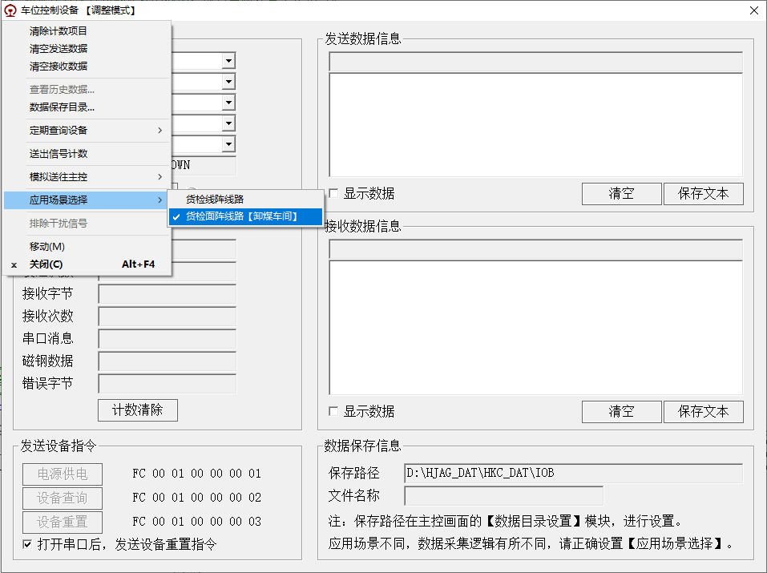

# 2024.12.07 - 敬业站（作业线）问题列表、及解决

## 1. 首节车辆没有拍照

### 1.1 问题描述

- 现象：  
  车辆停车在 01 位置，第一节车01之后，很久之后（发现的问题车辆是 30 分钟）才来11，导致未能对首节车辆进行图像采集。
- 原因：  
  长时间没有其它信号，信号数量不足，被认为是干扰信号。
- 解决：  
  判断属于干扰信号的时间参数公开，现场可以设置该信号。  

### 1.2 解决办法

- 查看车位设备信号采集模块的菜单设置：  
    
  确保设置为 `货检面阵线路【卸煤车间】` ，这样才不会发生超时导致画面结束。

## 2. 车辆图像采集只有 1 张

### 2.1 问题描述

- 现象：  
  有一列车的第 24 节车辆，只拍照了 1 张图像，而 25 节的 3 张图像才是 24 节车的真实数据。
- 原因：（01 11 01 11 10 11，两个01 11时间间隔过长）  
  车辆停车的钩档位置正好在 拍照镜头 所在位置的 光电开关的位置，造成干扰信号。
  本来排除该干扰信号的代码限制 10 秒内，有类似信号，才被认为是 干扰信号，但是这次发现的情况是 相差 4 分钟，所以未能正确排除该干扰信号。
- 解决：  
  10 秒的参数公开，另外程序需要判断是否有 10 信号，作为判断是否干扰的凭证。

### 2.2 解决办法

该参数已经存在于配置文件中。

- `HJS.sys`

  ```
  [HJS_CTRL]
  CAR_PAS_TIM_MIN=10
  ```

  默认 `CAR_PAS_TIM_MIN` 是 10 秒，把该数字修改为 10 分钟的 600 秒。
