# 货检系统安装注意事项

版本：Windows 10 系统安装 - 中文专业版

## 安装结束之后的处理事项

- 关闭任务栏上的【搜索框】

  系统任务栏上点击鼠标邮件，出现如下画面：

  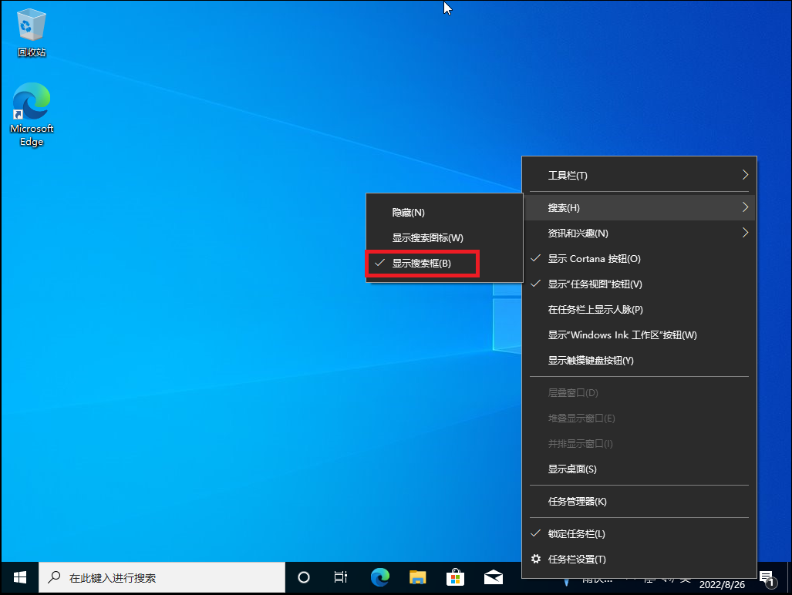

  【显示搜索框】的选择修改为【隐藏】：

  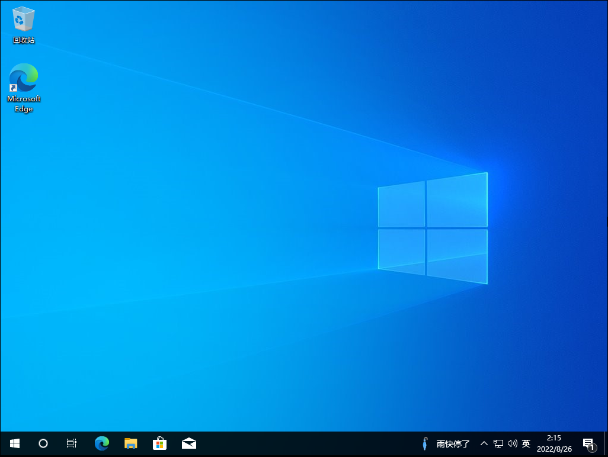

  

- 关闭任务栏上的【资讯和兴趣】

  系统任务条上点击鼠标邮件，出现如下画面：

  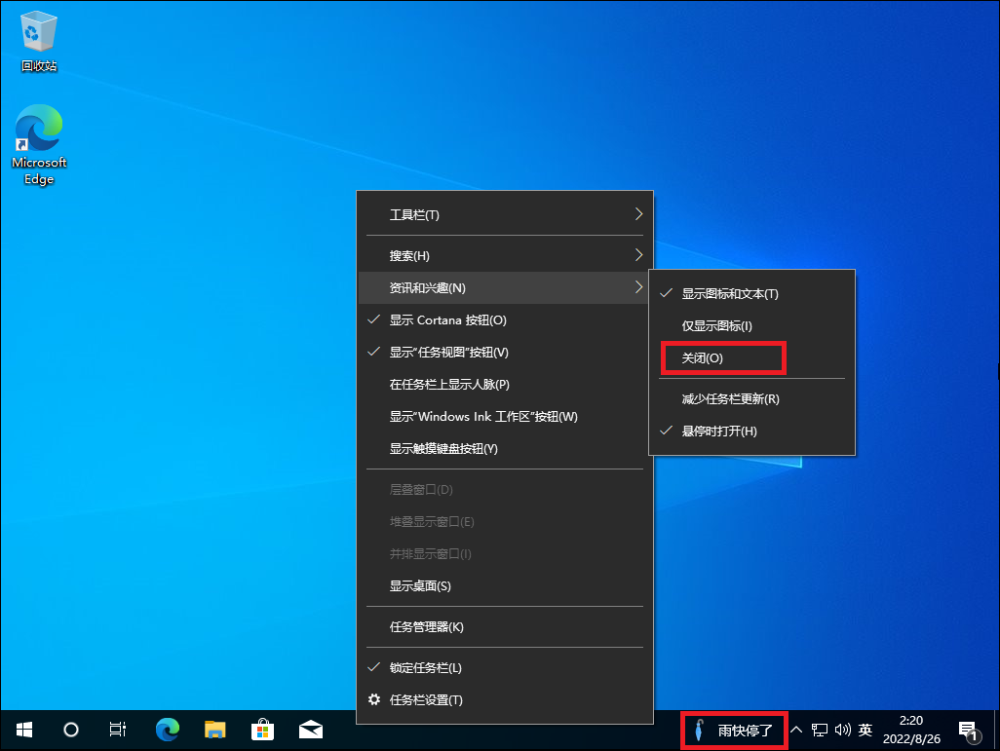

  选择【关闭】项目后，任务栏上的天气资讯就消失不见了。

- 关闭任务栏上的【显示Cortana按钮】

  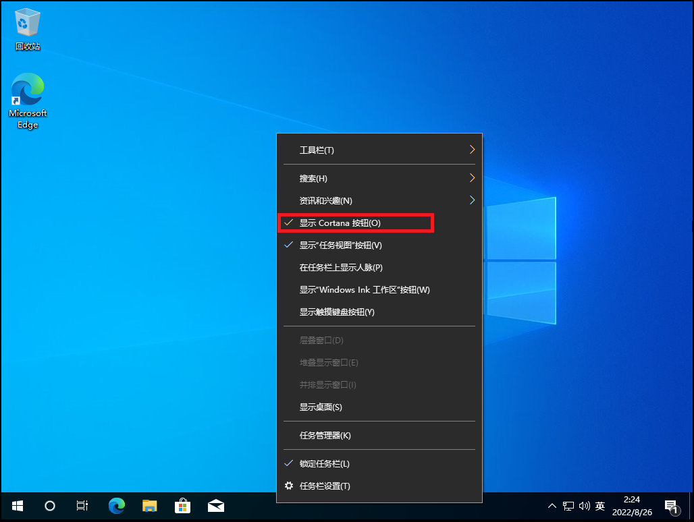

- 任务栏取消不需要项目

  不需要图标上，点击鼠标右键，选择【从任务栏取消固定】。

  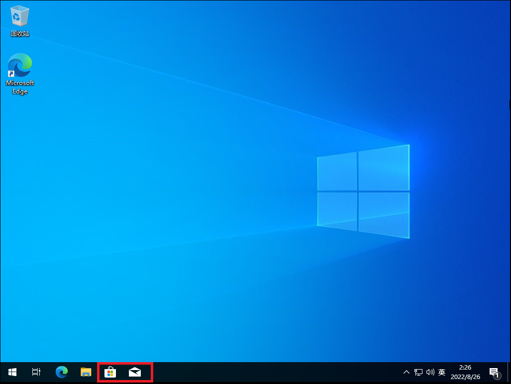

- 以上处理之后，系统任务栏清净多了。

  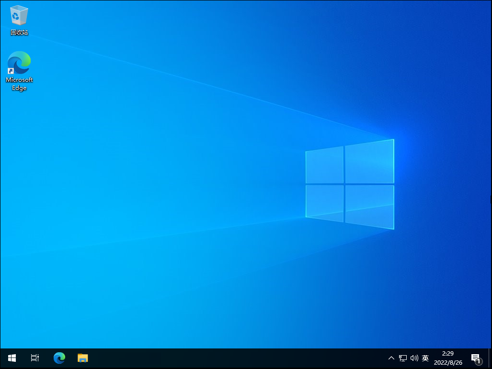

- 合并任务栏按钮

  任务栏点击鼠标右键，把【合并任务栏按钮】项目设置为【任务栏已满时】。

  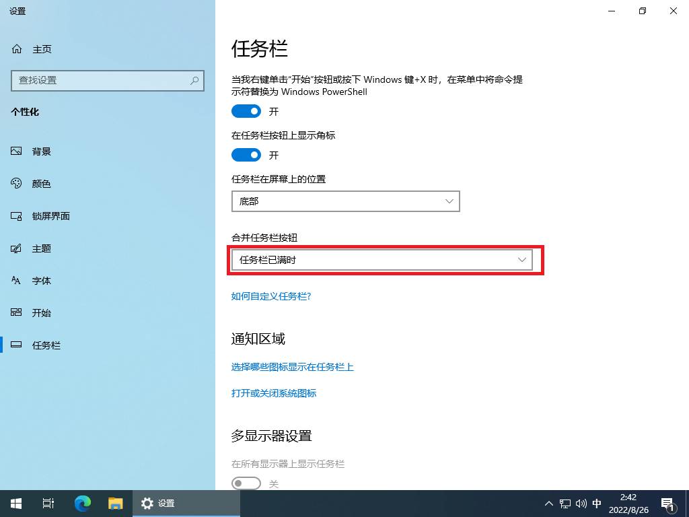

## 禁止各种推荐通知

- 【通知和操作】，如图所示，关闭三项通知：
  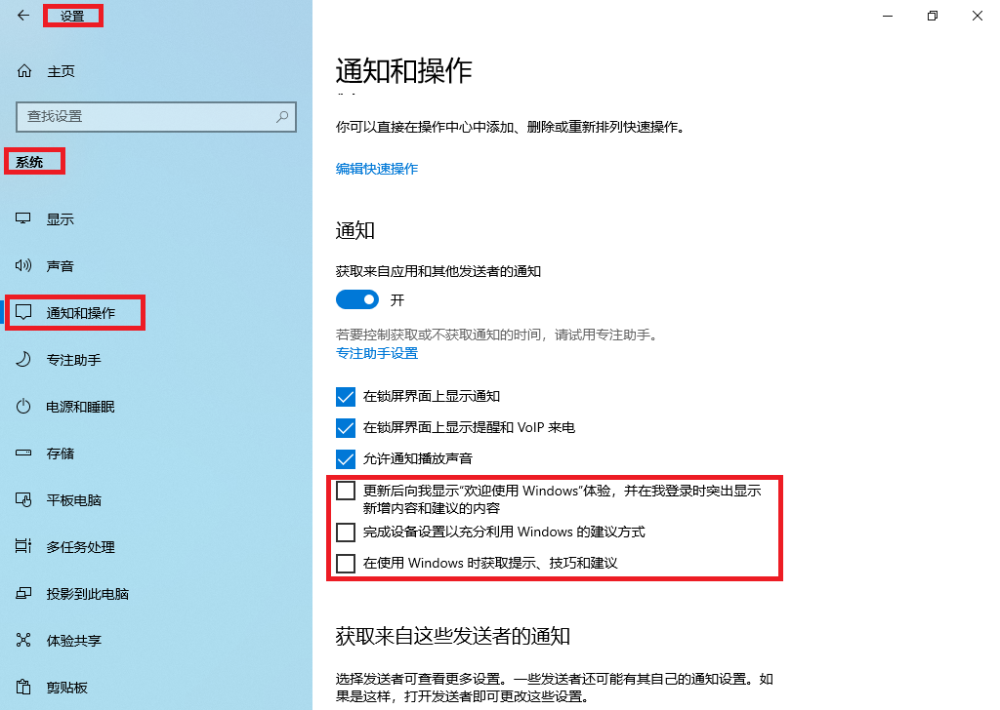

- 【在时间线中显示建议】，如下图所示关闭：

  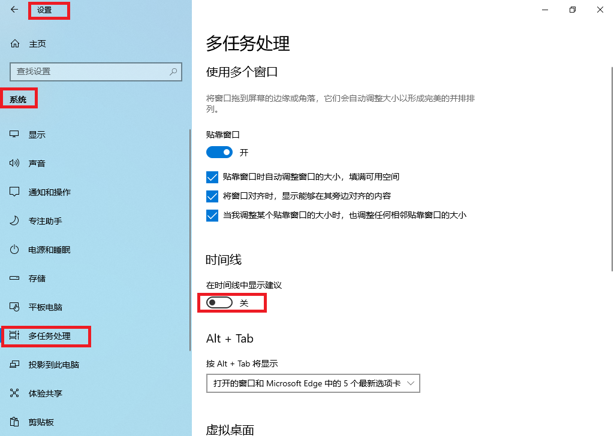

- 【偶尔在“开始”菜单中显示建议】，如下图关闭该项目：

  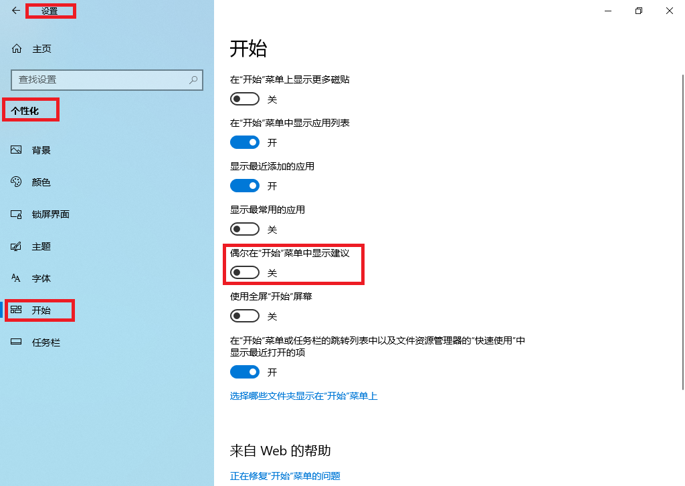

- 【隐私】，关闭如下图的三个项目项目：

  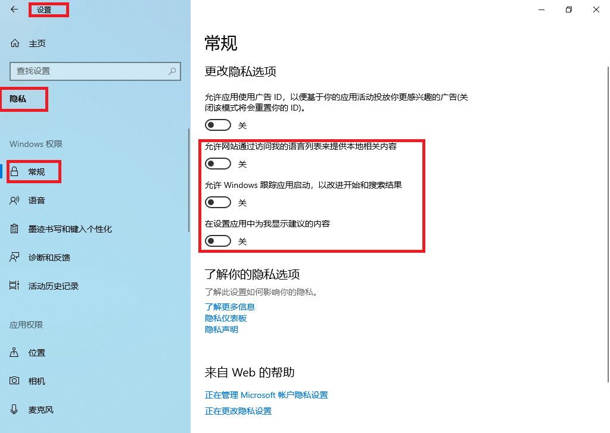

## 系统更新及清理

### 系统更新到最新状态

- 如下图所示，把系统更新到最新状态：

  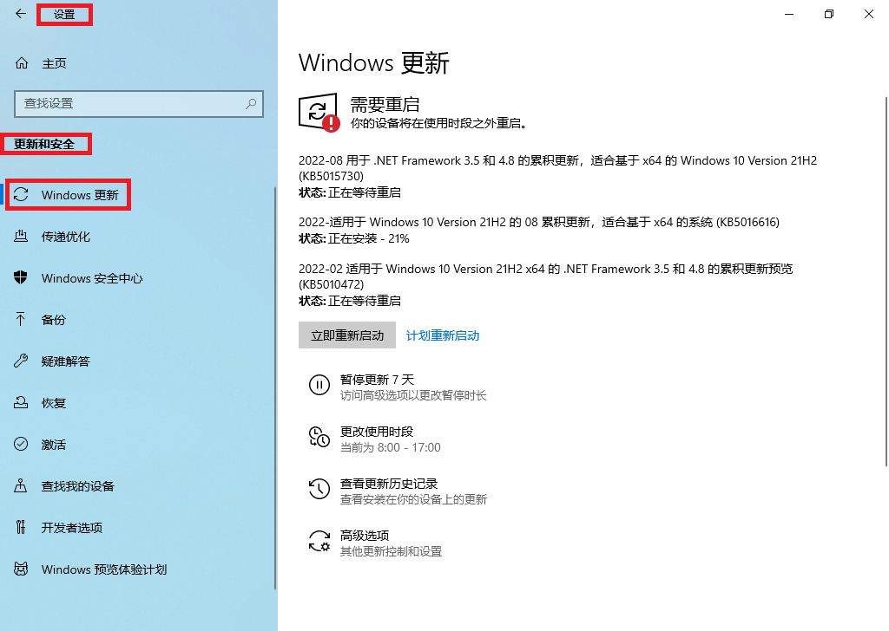

## 磁盘清理
