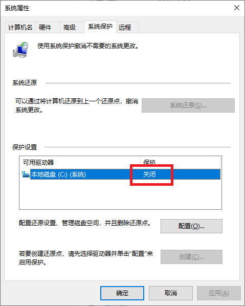
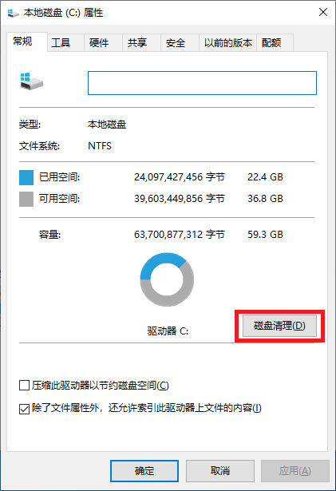
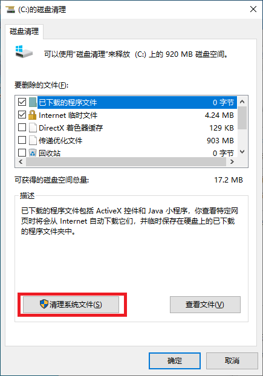
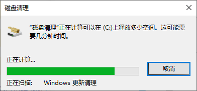
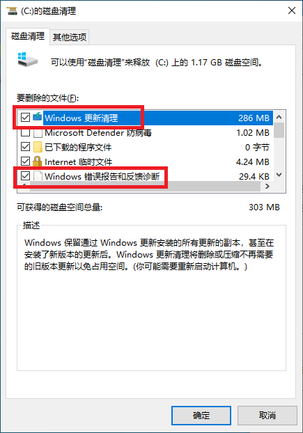
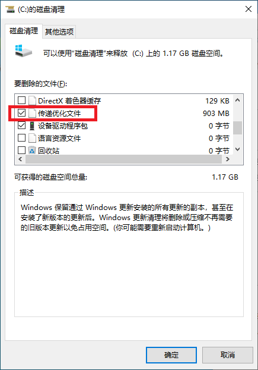
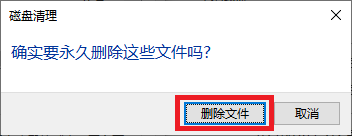
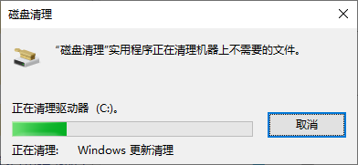
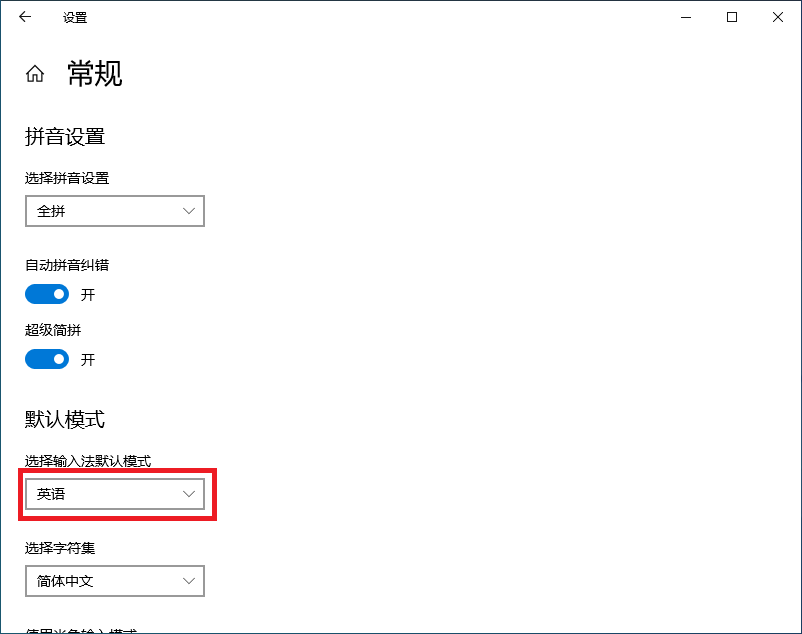

# 货检系统安装注意事项

版本：Windows 10 系统安装 - 中文专业版

## 1. 确保系统保护关闭

- 【此电脑】点击鼠标右键，下拉菜单中选择【属性】，显示画面右侧查找【系统保护】项目，点击代开：

  

  要保证系统盘的【系统保护】处于“关闭”状态，否则会导致各种备份，系统变慢。货检涉及大量数据操作，也必须关闭该项目。

  一般来说，专业版是默认处于**关闭**状态；但是家庭版默认是**打开**状态。

## 2. 关闭各种无需项目

- 关闭任务栏上的【搜索框】

  系统任务栏上点击鼠标邮件，出现如下画面：

  

  【显示搜索框】的选择修改为【隐藏】：

  

  

- 关闭任务栏上的【资讯和兴趣】

  系统任务条上点击鼠标邮件，出现如下画面：

  

  选择【关闭】项目后，任务栏上的天气资讯就消失不见了。

- 关闭任务栏上的【显示Cortana按钮】

  

- 任务栏取消不需要项目

  不需要图标上，点击鼠标右键，选择【从任务栏取消固定】。

  

- 以上处理之后，系统任务栏清净多了。

  

- 合并任务栏按钮

  任务栏点击鼠标右键，把【合并任务栏按钮】项目设置为【任务栏已满时】。

  

## 3. 禁止各种推荐通知

- 【通知和操作】，如图所示，关闭三项通知：
  

- 【在时间线中显示建议】，如下图所示关闭：

  

- 【偶尔在“开始”菜单中显示建议】，如下图关闭该项目：

  

- 【隐私】，关闭如下图的三个项目项目：

  

## 4. 系统更新及清理

### 4.1 系统更新到最新状态

- 如下图所示，把系统更新到最新状态：

  

### 4.2 系统磁盘垃圾清理

- 在系统盘（C盘）图标点击鼠标右键，下拉菜单中选择【属性】项目：

  

- 点击【磁盘清理】按钮，显示如下画面：

  

  点击【清理系统文件】按钮后，显示如下画面：

  

- 正常扫描结束之后，显示如下画面：

  

  向下滑动【要删除的文件】列表，继续选择：

  

  向下滑动【要删除的文件】列表，继续选择：

  

- 【要删除的文件】列表选择接收后，点击【确定】按钮：

  显示确认对话框，点击【删除文件】按钮，继续：

  

  显示正在删除文件的对话框：

  

  耐心等待一阵子（比较花费时间），删除接收之后，最好重新启动电脑。

## 5. 默认输入修改

电脑启动之后，默认输入为中文；而我们和普通用户不同，经常输入的却是指令类的英文，所以需要把默认输入修改为英文。

- 修改办法

  在任务栏右侧的语言输入图标上点击鼠标右键，选择【设置】项目，然后选择常规。

  

  这样修改之后，每次电脑启动之后，默认都是英文输入。

## 6. 关于浏览器

不清楚原因，Windows10 21H2自带的Edge用起来很不输入，建议安装其它浏览器；但是不建议安装国内流行的360之类的浏览器，实在不知道他们自带了什么东东。国际大厂的浏览器，代码几乎都是公开的，不敢随便自带不好的东西。

- Firefox

  https://www.firefox.com.cn/  
  https://www.mozilla.org/

- chrome

  https://www.google.com/intl/zh-CN/chrome/

## 7. 制作系统磁盘镜像

磁盘清理结束之后，重新启动电脑，确认电脑正常的情况下，关闭电脑，保留电脑此刻的状态。

- 普通电脑

  当前，电脑普遍用EFI(Extensible Firmware Interface)，代替了BIOS启动。所以想要从USB闪存启动，利用GHOST制作GHO磁盘镜像还是存在一定难度的。

  实在没有办法的话，需要把硬盘取出来，用一台BIOS启动的电脑来制作磁盘备份的GHO镜像文件。

- 虚拟机

  在宿主机上，进行虚拟机的磁盘**优化**及**压缩**硬盘，保证虚拟机磁盘在宿主机硬盘里面占用最小磁盘空间。

  然后保留快照，能够保证出现错误的时候，随时能够恢复到保留快照的状态。
