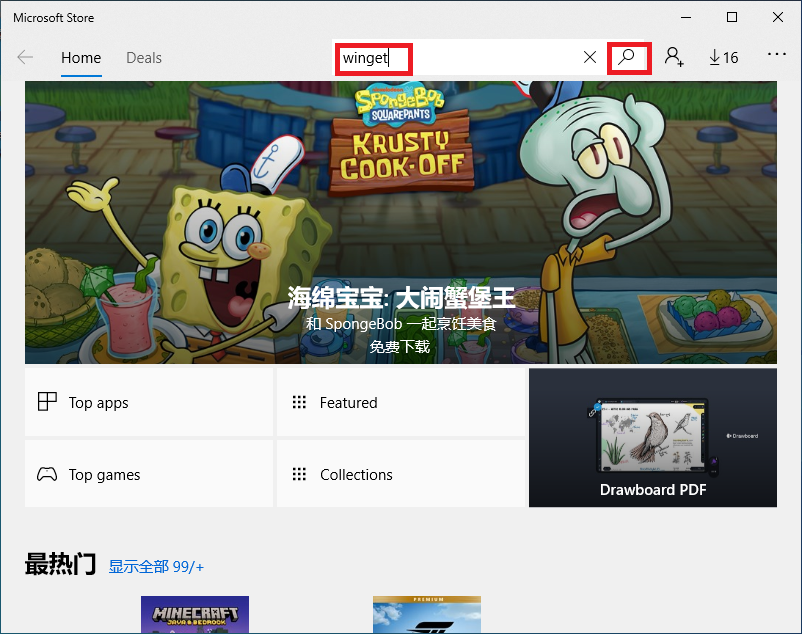
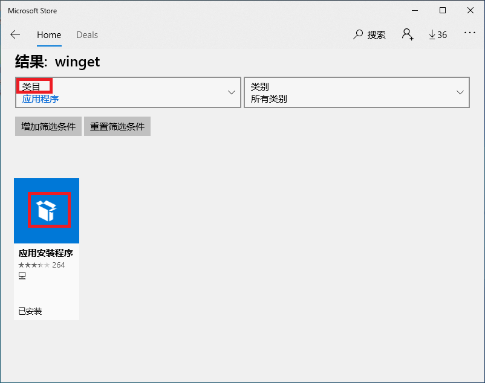
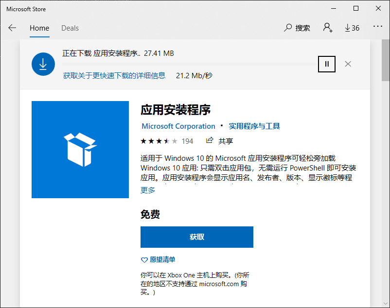
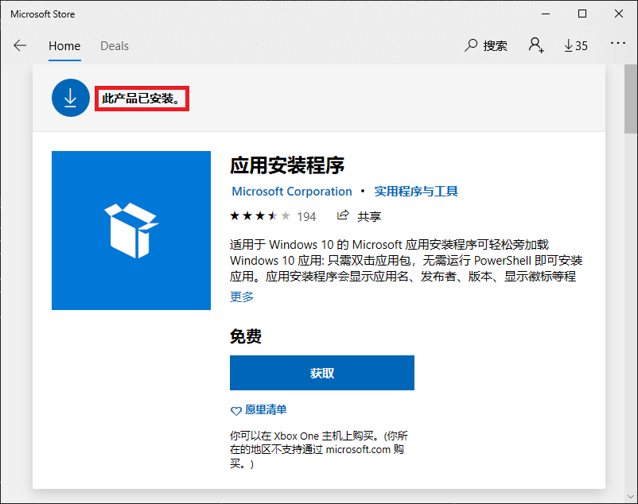
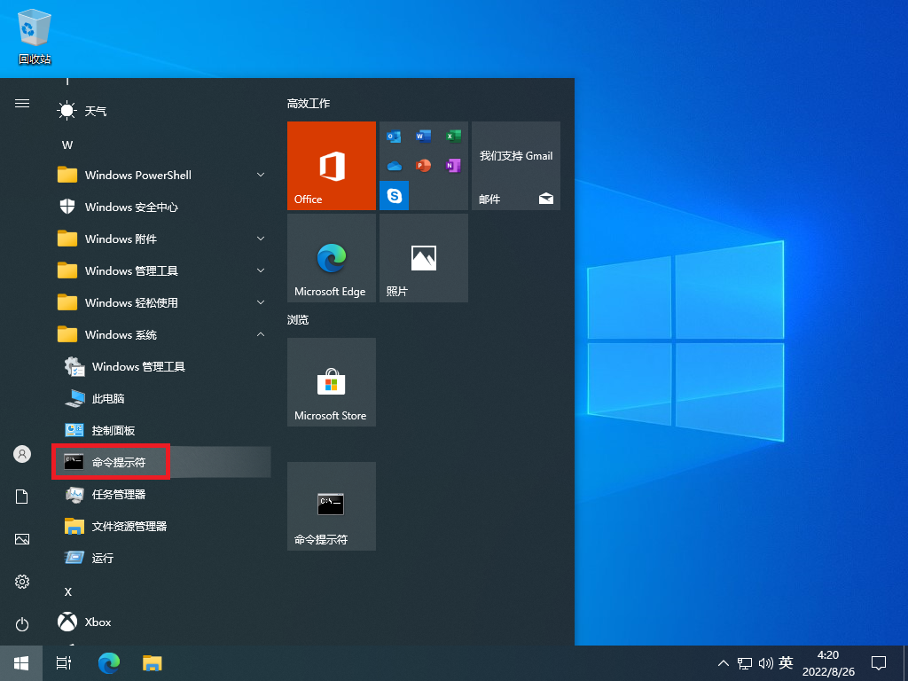
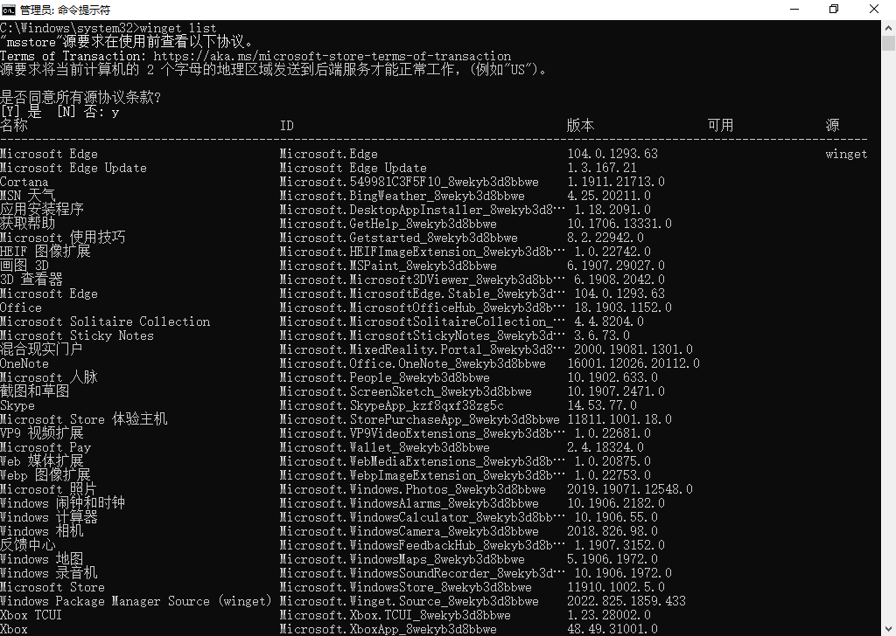
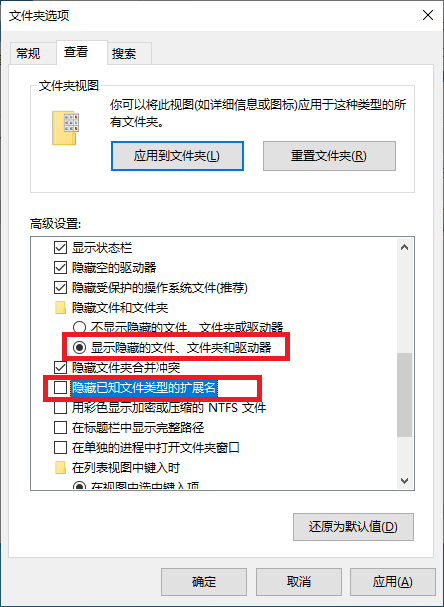

# 系统应用深度清理

系统中存在很多无需软件，货检系统根本用不着，所以尽量都清除掉。

## 1. 安装 winget 

- 启动**Microsoft Store**，点击**搜索**按钮，在搜索框中输入**winget**：

  

- 点击【搜索】按钮，很快会显示搜索结果；在【类目】中选择【应用程序】，则会显示画面所示的“应用安装程序”：

  

  ※如果该软件状态显示为“**已安装**”的话，不需要重新安装；如果没有安装，则安装该应用程序。21H2版本默认已经安装，之前的旧版本Windows10则需要手动安装该应用。

- 点击应用图标后，自动开始下载：

  

- 下载结束后，显示“此产品已安装”，无需点击下部的【获取】按钮，就可以使用。

  

## 2. 删除无需应用

- 把【命令提示符】固化到开始菜单中

  之后货检处理要经常用到该应用，所以最好是把该应用固化到开始菜单，这样随后的工作要顺利一些。

  【菜单】→【Windows系统】→【命令提示符】上点击鼠标右键，选择【固定到“开始”菜单】项目。

  

- 以管理员身份启动【命令提示符】，输入如下指令：

  ```shell
  winget list
  ```

  系统安装的所有软件被列出，显示画面如下：

  

- 删除无需应用

  针对货检系统，如下为无需应用，应该予以删除：

  | 名称                           | ID                                                   | 版本                | 备注   |
  | ------------------------------ | ---------------------------------------------------- | ------------------- | ------ |
  | Cortana                        | Microsoft.549981C3F5F10_8wekyb3d8bbwe                | 1.1911.21713.0      |        |
  | MSN 天气                       | Microsoft.BingWeather_8wekyb3d8bbwe                  | 4.25.20211.0        | 〇     |
  | Microsoft 使用技巧             | Microsoft.Getstarted_8wekyb3d8bbwe                   | 8.2.22942.0         | 〇     |
  | Microsoft Edge                 | Microsoft.MicrosoftEdge.Stable_8wekyb3d8bbwe         | 104.0.1293.63       | 〇     |
  | Office                         | Microsoft.MicrosoftOfficeHub_8wekyb3d8bbwe           | 18.1903.1152.0      | 〇     |
  | Microsoft Solitaire Collection | Microsoft.MicrosoftSolitaireCollection_8wekyb3d8bbwe | 4.4.8204.0          | 〇游戏 |
  | Microsoft Sticky Notes         | Microsoft.MicrosoftStickyNotes_8wekyb3d8bbwe         | 3.6.73.0            | 〇     |
  | 混合现实门户                   | Microsoft.MixedReality.Portal_8wekyb3d8bbwe          | 2000.19081.1301.0   | 〇     |
  | OneNote                        | Microsoft.Office.OneNote_8wekyb3d8bbwe               | 16001.12026.20112.0 | 〇     |
  | Microsoft 人脉                 | Microsoft.People_8wekyb3d8bbwe                       | 10.1902.633.0       | 〇     |
  | Skype                          | Microsoft.SkypeApp_kzf8qxf38zg5c                     | 14.53.77.0          | 〇     |
  | Microsoft Store 体验主机       | Microsoft.StorePurchaseApp_8wekyb3d8bbwe             | 11811.1001.18.0     | 〇     |
  | Microsoft Pay                  | Microsoft.Wallet_8wekyb3d8bbwe                       | 2.4.18324.0         | 〇     |
  | Microsoft 照片                 | Microsoft.WebpImageExtension_8wekyb3d8bbwe           | 2019.19071.12548.0  | 〇     |
  | Windows 闹钟和时钟             | Microsoft.WindowsAlarms_8wekyb3d8bbwe                | 10.1906.2182.0      | 〇     |
  | Windows 相机                   | Microsoft.WindowsCamera_8wekyb3d8bbwe                | 2018.826.98.0       | 〇     |
  | 反馈中心                       | Microsoft.WindowsFeedbackHub_8wekyb3d8bbwe           | 1.1907.3152.0       | 〇     |
  | Windows 地图                   | Microsoft.WindowsMaps_8wekyb3d8bbwe                  | 5.1906.1972.0       | 〇     |
  | Windows 录音机                 | Microsoft.WindowsSoundRecorder_8wekyb3d8bbwe         | 10.1906.1972.0      | 〇     |
  | Xbox TCUI                      | Microsoft.Xbox.TCUI_8wekyb3d8bbwe                    | 1.23.28002.0        |        |
  | Xbox                           | Microsoft.XboxApp_8wekyb3d8bbwe                      | 48.49.31001.0       |        |
  | Xbox Game Bar Plugin           | Microsoft.XboxGameOverlay_8wekyb3d8bbwe              | 1.46.11001.0        |        |
  | Xbox Game Bar                  | Microsoft.XboxGamingOverlay_8wekyb3d8bb…             | 2.34.28001.0        |        |
  | Xbox Identity Provider         | Microsoft.XboxIdentityProvider_8wekyb3d…             | 12.50.6001.0        |        |
  | Xbox Game Speech Window        | Microsoft.XboxSpeechToTextOverlay_8weky…             | 1.17.29001.0        |        |
  | 你的手机                       | Microsoft.YourPhone_8wekyb3d8bbwe                    | 0.19051.7.0         |        |
  | Groove 音乐                    | Microsoft.ZuneMusic_8wekyb3d8bbwe                    | 10.19071.19011.0    |        |
  | 电影和电视                     | Microsoft.ZuneVideo_8wekyb3d8bbwe                    | 10.19071.19011.0    |        |
  | Microsoft OneDrive             | Microsoft.OneDrive                                   | 21.220.1024.0005    |        |
  | 邮件和日历                     | microsoft.windowscommunicationsapps_8we…             | 16005.11629.20316.0 |        |
  | Windows 电脑健康状况检查       | {1ED1DB4E-6253-4E80-9315-414B1E721D05}               | 3.6.2204.08001      |        |

  如下指令清除应用：

  ```
  winget uninstall [app-id
  ```

  可以指做一个批处理文件：

  ```
  winget uninstall Microsoft.549981C3F5F10_8wekyb3d8bbwe
  winget uninstall Microsoft.GetHelp_8wekyb3d8bbwe
  ...
  winget uninstall Microsoft.XboxApp_8wekyb3d8bbwe
  winget uninstall Microsoft.XboxGameOverlay_8wekyb3d8bbwe
  winget uninstall Microsoft.XboxGamingOverlay_8wekyb3d8bbwe
  winget uninstall Microsoft.XboxIdentityProvider_8wekyb3d8bbwe
  winget uninstall Microsoft.XboxSpeechToTextOverlay_8wekyb3d8bbwe
  winget uninstall Microsoft.YourPhone_8wekyb3d8bbwe
  winget uninstall Microsoft.ZuneMusic_8wekyb3d8bbwe
  winget uninstall Microsoft.ZuneVideo_8wekyb3d8bbwe
  ```

- 清除之后的软件信息

  ```
  C:\Windows\system32>winget list
  名称                                                              ID                                                版本                可用          源
  ------------------------------------------------------------------------------------------------------------------------------------------------------------
  Microsoft Edge                                                    Microsoft.Edge                                    104.0.1293.63                     winget
  Microsoft Edge Update                                             Microsoft Edge Update                             1.3.167.21
  应用安装程序                                                      Microsoft.DesktopAppInstaller_8wekyb3d8bbwe       1.18.2091.0
  HEIF 图像扩展                                                     Microsoft.HEIFImageExtension_8wekyb3d8bbwe        1.0.22742.0
  画图 3D                                                           Microsoft.MSPaint_8wekyb3d8bbwe                   6.1907.29027.0
  3D 查看器                                                         Microsoft.Microsoft3DViewer_8wekyb3d8bbwe         6.1908.2042.0
  截图和草图                                                        Microsoft.ScreenSketch_8wekyb3d8bbwe              10.1907.2471.0
  VP9 视频扩展                                                      Microsoft.VP9VideoExtensions_8wekyb3d8bbwe        1.0.22681.0
  Web 媒体扩展                                                      Microsoft.WebMediaExtensions_8wekyb3d8bbwe        1.0.20875.0
  Windows 计算器                                                    Microsoft.WindowsCalculator_8wekyb3d8bbwe         10.1906.55.0
  Microsoft Store                                                   Microsoft.WindowsStore_8wekyb3d8bbwe              11910.1002.5.0
  Windows Package Manager Source (winget)                           Microsoft.Winget.Source_8wekyb3d8bbwe             2022.825.2058.463
  邮件和日历                                                        microsoft.windowscommunicationsapps_8wekyb3d8bbwe 16005.11629.20316.0
  Microsoft Visual C++ 2015-2019 Redistributable (x86) - 14.28.299… Microsoft.VC++2015-2019Redist-x86                 14.28.29913.0       14.29.30139.0 winget
  Windows 电脑健康状况检查                                          {1ED1DB4E-6253-4E80-9315-414B1E721D05}            3.6.2204.08001
  VMware Tools                                                      {1FF5D624-5515-4343-837A-E54C101573E6}            11.3.5.18557794
  Microsoft Update Health Tools                                     {7B1FCD52-8F6B-4F12-A143-361EA39F5E7C}            3.67.0.0
  Microsoft Visual C++ 2015-2019 Redistributable (x64) - 14.28.299… Microsoft.VC++2015-2019Redist-x64                 14.28.29913.0       14.29.30139.0 winget
  ```

## 3. 更新软件应用

- 列表应用更新

  看起来干净多了，不过有几个软件需要更新：

  ```
  Microsoft Visual C++ 2015-2019 Redistributable (x86) - 14.28.299… Microsoft.VC++2015-2019Redist-x86                 14.28.29913.0       14.29.30139.0 winget
  Microsoft Visual C++ 2015-2019 Redistributable (x64) - 14.28.299… Microsoft.VC++2015-2019Redist-x64                 14.28.29913.0       14.29.30139.0 winget
  ```

- 执行应用更新

  执行如下指令进行更新：

  ```
  winget upgrade --id Microsoft.VC++2015-2019Redist-x86
  winget upgrade --id Microsoft.VC++2015-2019Redist-x64
  ```

  更新后继续列表显示：

  ```
  C:\Windows\system32>winget list
  名称                                                               ID                                                版本                源
  ------------------------------------------------------------------------------------------------------------------------------------------------
  Microsoft Edge                                                     Microsoft.Edge                                    104.0.1293.63       winget
  Microsoft Edge Update                                              Microsoft Edge Update                             1.3.167.21
  应用安装程序                                                       Microsoft.DesktopAppInstaller_8wekyb3d8bbwe       1.18.2091.0
  HEIF 图像扩展                                                      Microsoft.HEIFImageExtension_8wekyb3d8bbwe        1.0.22742.0
  画图 3D                                                            Microsoft.MSPaint_8wekyb3d8bbwe                   6.1907.29027.0
  3D 查看器                                                          Microsoft.Microsoft3DViewer_8wekyb3d8bbwe         6.1908.2042.0
  截图和草图                                                         Microsoft.ScreenSketch_8wekyb3d8bbwe              10.1907.2471.0
  VP9 视频扩展                                                       Microsoft.VP9VideoExtensions_8wekyb3d8bbwe        1.0.22681.0
  Web 媒体扩展                                                       Microsoft.WebMediaExtensions_8wekyb3d8bbwe        1.0.20875.0
  Windows 计算器                                                     Microsoft.WindowsCalculator_8wekyb3d8bbwe         10.1906.55.0
  Microsoft Store                                                    Microsoft.WindowsStore_8wekyb3d8bbwe              11910.1002.5.0
  Windows Package Manager Source (winget)                            Microsoft.Winget.Source_8wekyb3d8bbwe             2022.825.2058.463
  邮件和日历                                                         microsoft.windowscommunicationsapps_8wekyb3d8bbwe 16005.11629.20316.0
  Windows 电脑健康状况检查                                           {1ED1DB4E-6253-4E80-9315-414B1E721D05}            3.6.2204.08001
  VMware Tools                                                       {1FF5D624-5515-4343-837A-E54C101573E6}            11.3.5.18557794
  Microsoft Visual C++ 2015-2019 Redistributable (x64) - 14.29.30139 Microsoft.VC++2015-2019Redist-x64                 14.29.30139.0       winget
  Microsoft Update Health Tools                                      {7B1FCD52-8F6B-4F12-A143-361EA39F5E7C}            3.67.0.0
  Microsoft Visual C++ 2015-2019 Redistributable (x86) - 14.29.30139 Microsoft.VC++2015-2019Redist-x86                 14.29.30139.0       winget
  ```

  


## 4. 文件夹选项

- 为了后续方便，如图修改相应项目：

  


## 5. 应用清理小结

- 以上所有处理结束之后，一定要重新启动电脑，确认所有状态正常。

- 尽量也能对系统盘做一个GHO影像，这样在系统崩溃、错误的时候，随时可以恢复。