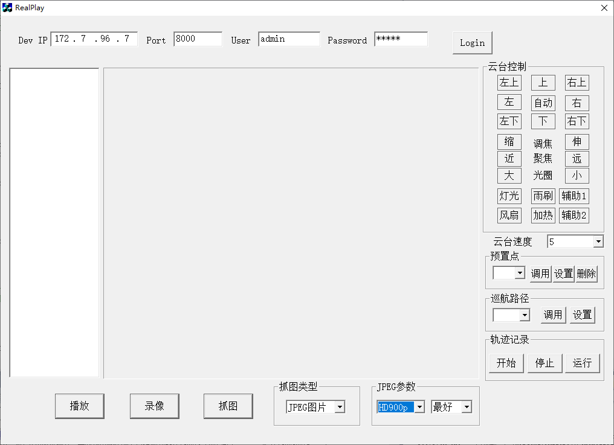

# 关于海康广角相机的图像抓取


## 使用SDK版本

> CH-HCNetSDKV6.1.9.47_build20221111_win64_20221216145359  
>
> 本机保存位置：`G:\海康相机SDK-广角`  
>
> - 相关模块  
>   1- 实时预览&抓图&云台控制

## 抓图程序画面

- 程序启动画面

  

  从画面看，能够抓取的最好画质是 `HD900p`，其大小是 `1600x912`，所以明显是不符合要求的。  
  所以必须选择采集 `BMP` 图像，看看是否能够采集到更高分辨率的图像。

- 抓图代码  
  
  ```C++
  void CRealPlayDlg::OnButtonCapture() 
  {
  	if(m_lPlayHandle == -1)
  	{
  		MessageBox("请先选择一个通道播放");
  		return;
  	}
  	UpdateData(TRUE);
  
  	char PicName[256] = {0};
  	
  	int iPicType = m_coPicType.GetCurSel();
  	if(0 == iPicType)  //bmp
  	{
  		CTime CurTime = CTime::GetCurrentTime();;
  		sprintf(PicName,"%04d%02d%02d%02d%02d%02d_ch%02d.bmp",CurTime.GetYear(),CurTime.GetMonth(),CurTime.GetDay(), \
  			CurTime.GetHour(),CurTime.GetMinute(),CurTime.GetSecond(),m_struDeviceInfo.struChanInfo[GetCurChanIndex()].iChanIndex);
  	
  		if(NET_DVR_CapturePicture(m_lPlayHandle,PicName))
  		{
  			MessageBox("抓图成功!");
  		}
  	}
  	else if(1 == iPicType)  //jgp
  	{
  		CTime CurTime = CTime::GetCurrentTime();;
  		sprintf(PicName,"%04d%02d%02d%02d%02d%02d_ch%02d.jpg",CurTime.GetYear(),CurTime.GetMonth(),CurTime.GetDay(), \
  			CurTime.GetHour(),CurTime.GetMinute(),CurTime.GetSecond(),m_struDeviceInfo.struChanInfo[GetCurChanIndex()].iChanIndex);
  	
  		//组建jpg结构
  		NET_DVR_JPEGPARA JpgPara = {0};
  		JpgPara.wPicSize = (WORD)m_coJpgSize.GetCurSel();
  		JpgPara.wPicQuality = (WORD)m_coJpgQuality.GetCurSel();
  
  		LONG iCurChan = m_struDeviceInfo.struChanInfo[GetCurChanIndex()].iChanIndex;
  
  		if(NET_DVR_CaptureJPEGPicture(m_struDeviceInfo.lLoginID, iCurChan, &JpgPara, PicName))
  		{
  			MessageBox("抓图成功");
  		}
  	}
  	
  	return;	
  }
  ```
  
  `NET_DVR_CapturePicture(m_lPlayHandle,PicName)` 中使用到 `m_lPlayHandle` 变量，只有在 `播放` 按钮点击之后才给赋值。
  所以，从代码看，好像是必须开始 `播放` 之后，才能够执行 `抓图` 功能，这个也要测试一下。  
  如果确实这样的话，确实非常麻烦。估计必须直接和相机连接，才能够采集到更高画质的图像。
  
- 多通道同时抓图  
  从代码看，单纯程序执行是保存结束才能返回，所以 如果要多通道同时抓图的话，需要采用多线程模式；但是因为相机不在我手边，估计会采用多进程模式，这样开发起来相对简单（单纯）一些，可以大脑抽象就可以解决。